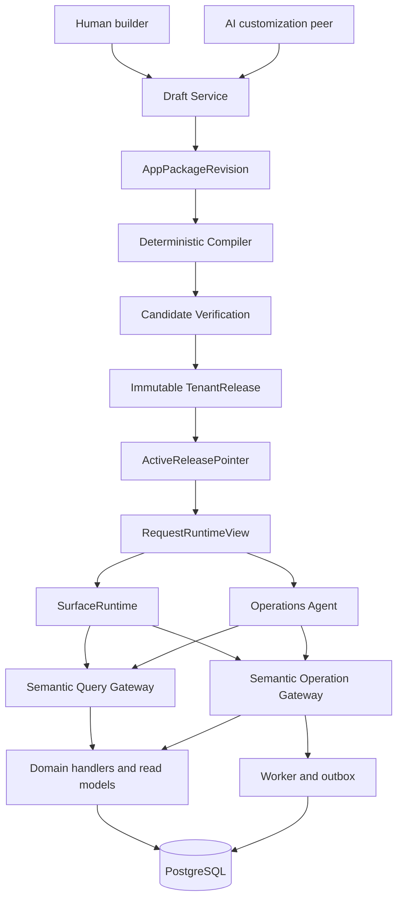
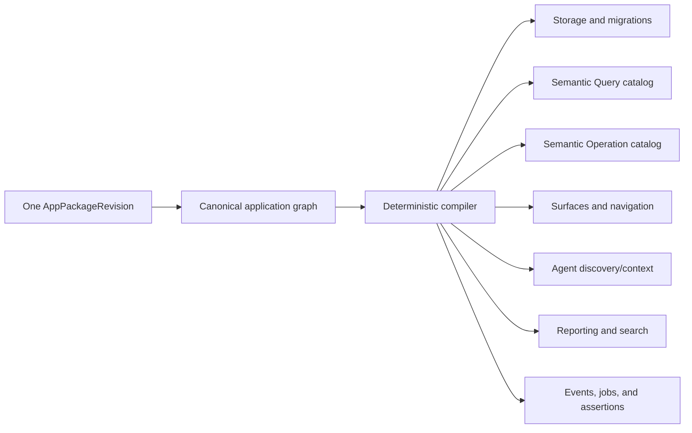
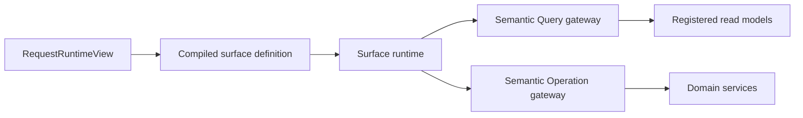
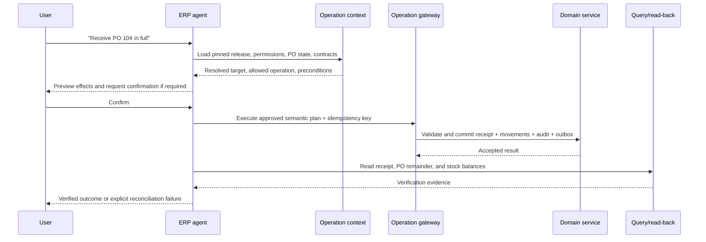
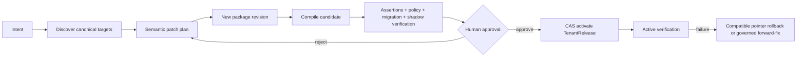

# Greenfield North-Star ERP Platform Plan

Status: Canonical end-to-end program authority for the new greenfield repository, from first launch through the full north star
Date: 2026-07-20
Scope: A clean-repository ERP product with inventory-first delivery and a staged path to the full north-star platform
Assumption: The current 2rain ERP has no live users, production record authority, or integrations that require continuous compatibility
Reference: `canonical-erp-platform-replatform-plan-v2.md` remains the authority for replatforming the existing repository; its north-star constitution and capability blueprint inform this plan, but its migration sequence does not apply here
Salvage: Section 1.2 governs all reuse of prior-repository code, tests, and design documents; per-stage "Salvage inputs" blocks name the exact assets

## 0. Decision

Build a new product in a clean repository.

Start with one production-shaped purchasing, inventory, and sales loop. Ship it
as a useful ERP product with an AI operations agent and a deliberately bounded
customization engine. Grow the same canonical model, compiler, release runtime,
semantic gateways, UI runtime, and agent architecture into progressively richer
customization, new modules, domain capability packs, workflows, connectors, and
controlled extensions.

Do not copy the old static-metadata-plus-overlay authority model. Do not build a
platform framework before proving the inventory product. Do not create
compatibility projections, bidirectional synchronization, provider-transition
machinery, or legacy retirement gates when there is no live authority to
protect.

The product path is:

1. establish the canonical/release kernel;
2. deliver inventory truth and ordinary inventory operations;
3. close the purchasing-to-receiving loop;
4. close the sales-to-reservation-to-shipping loop;
5. ship the operations agent and basic compiled customization with the launch;
6. prove a whole generated module without platform branches;
7. add workflows, communication, reusable domain packs, complex behavior, and
   controlled extensions from product demand; and
8. reach the complete north-star capability/evidence definition.

## 1. Starting assumptions and authority

This plan is valid while all of these remain true:

- no current user depends on the existing ERP for daily operations;
- no production business database must remain the live source of truth;
- no external integration depends on existing action, route, or schema
  contracts;
- any useful sample or historical data can be imported once through a governed
  migration rather than synchronized continuously; and
- product leadership accepts the new repository as the future product, not a
  disposable prototype.

If any assumption becomes false before launch, pause and decide explicitly
whether to import once, isolate the new tenant, or return to a strangler
transition. Never improvise dual writes or reverse synchronization.

Authority in the new product is:

| Concern                           | Authority                                                                         |
| --------------------------------- | --------------------------------------------------------------------------------- |
| Application desired state         | Versioned `AppPackageRevision`                                                    |
| Deployable application definition | Immutable `TenantRelease`                                                         |
| Active application version        | CAS pointer keyed by trusted tenant and environment                               |
| Business records                  | PostgreSQL domain tables or registered generated-record storage                   |
| Business scoping within a tenant  | Compiled `legalEntityId` dimension on every business record (ADR-0015)            |
| Inventory truth                   | Append-only posted inventory movements plus active reservation facts              |
| Inventory stock identity          | The versioned stock-dimension set (ADR-0016)                                      |
| Business time                     | Distinct `effectiveAt`/`recordedAt` under the tenant-declared business day (ADR-0018) |
| Current access                    | Identity and Policy gateways using trusted current context                        |
| Normal application reads          | Semantic Query Gateway over registered read models                                |
| Business writes and effects       | Semantic Operation Gateway over generated or registered handlers                  |
| Audit, lifecycle, and recovery    | Shared change-document, lifecycle, outbox, and recovery services                  |
| UI and agent context              | One request-pinned `RequestRuntimeView`                                           |
| Customization                     | New complete application revisions; never an independently active overlay lineage |

### 1.1 How this document governs the program

This is the single **scope, architecture, and completion** authority for the
greenfield product. It governs the quick launch and every subsequent platform
stage through the full north star. The existing replatform v2 document continues
to govern only work in the existing repository.

**SEQUENCING IS DEVOLVED to `docs/execution/current-plan.md` — ruled 2026-08-22 by
the user, disposing program-review finding R4.** This paragraph previously claimed
sequencing authority too, and the 2026-08-20 program review measured that the claim
was not honoured: *"the plan calls itself 'the single sequencing authority' while
real authority is the TRIAGE plus user directives never written back into it."*
**A nominally supreme, practically ignored authority is worse than an honest
division**, because a reader cannot tell which parts are live.

**So: what to build and what "done" means live here. What runs next, and in what
order, lives in `current-plan.md`.** The stage-gate evidence instrument is NOT
revived — the alternative disposition R4 offered — so nothing structurally catches
scope that evaporates between packet acceptances.

**The consequence, and every packet charter must carry it:** where a stage's build
list names something whose absence fails no gate — a read model, a browsable view,
an agent journey — **the packet that owns it names it as an explicit acceptance
criterion in its own charter.** That is now the only thing standing between
declared scope and silent evaporation, and it is a per-packet obligation rather
than a stage-boundary check. G3 lost balance and availability read models, a
stock-overview UI, and agent support exactly this way, and the loss surfaced as
*"why can't a pilot user see anything."*

The program has two horizons:

- **Launch horizon:** G0 through G8. Deliver the narrow inventory,
  purchasing, sales, operations-agent, and basic-customization product.
- **North-star horizon:** N1 through N7. Expand the same product until ordinary
  modules are declarative, specialized behavior composes through domain packs,
  and genuinely novel behavior uses controlled extensions.

The phase labels express dependency order, not calendar promises. At G0 the
team converts the ordered backlog into calendar forecasts using actual staffing
and updates forecasts after every gate. A date may move; a dependency or
completion gate may not be silently skipped.

Program rules:

1. Every platform capability, domain pack, module, and cross-cutting obligation
   must have one owning stage, work-package ID, dependencies, support status,
   evidence requirements, and completion gate in this document.
2. A stage begins implementation only after its dependencies are accepted. Safe
   exploratory branches may run earlier but cannot become runtime authority.
3. Detailed ADRs, schemas, mission packets, and implementation plans refine this
   document; they may not contradict its authority, invariants, or gates.
4. Each accepted stage updates the capability matrix, evidence ledger, known
   limits, benchmark history, and next-stage forecast.
5. New product demand is mapped to an existing capability, admitted as a
   reusable capability/domain-pack addition, routed to the controlled extension
   tier, or explicitly deferred. It does not create a tenant-specific fork.
6. “Done” always means supported end to end: authoring, compilation, runtime,
   storage, policy, UI, query, operation, agent, reporting, migration, read-back,
   recovery, and tests as applicable.
7. Full north-star completion is the gate in Section 12.11, not the completion
   of the initial inventory launch.

The execution ledger uses these statuses:

`planned -> admitted -> active -> evidence_ready -> accepted`

`blocked` is used only when an explicit dependency, decision, or external
condition prevents progress. Rejected evidence returns the work package to
`active` with recorded findings; it does not weaken the gate.

### 1.2 Prior-repository salvage contract

The prior repository is the existing 2rain ERP working tree in which this plan
was drafted (`/home/rvham/2rain_erp`, branch `chess`, plus the frozen candidate
branch `codex/p02-inventory-core@33ca8bb`). It is a design-and-evidence quarry,
never a runtime dependency: the new repository must not import from it, and
salvaged material lands only through the admission workflow below. Paths in the
per-stage "Salvage inputs" blocks are relative to the prior repository's root.

Three transfer modes are allowed:

- **PORT** — code adapted into this repository. Every port is admitted through
  a KEEP / REWRITE / REJECT record at the stage that consumes it, following the
  template proven by the prior repository's
  `docs/replatform/d01-p02-current-base-admission-final-2026-07-20.md`. Nothing
  crosses over unaudited, and a port that fails its admission conditions is
  rejected, not patched silently.
- **RE-EXPRESS** — a prior test suite is used as the behavioral specification
  and rewritten against the new contracts. Prior assertions may be strengthened
  or consciously retired with a recorded reason; they may not be silently
  weakened.
- **REFERENCE** — design documents, spike reports, rulings, and lessons are
  consulted during design and cited in ADRs; the artifact itself does not land
  in this repository.

"The v1 corpus" in salvage blocks means the prior repository's
`docs/canonical-erp-platform-replatform-plan.md` — the citation-stable design
reference whose section numbers are preserved. It carries deep researched
design (semantics, builder UX, autonomy, fleet operations) that this plan
deliberately does not restate; the per-stage blocks below name the exact
sections each stage must consult.

Never transfer, in any mode:

- the static-metadata plus overlay dual lineage (`shared/metadata/modules.ts`,
  `server/runtime-manifest/overlay-applier.ts`, `base-adapter.ts`);
- the deployment-global activation pointer
  (`server/runtime-manifest/provider.ts`);
- the one-physical-action-file-per-tool architecture (`actions/*.ts`);
- typed EAV as a universal storage answer;
- the multi-framework agent stack (`@langchain/langgraph`, `@openai/agents`,
  and `ai` side by side); and
- mission reports, probe scripts, development databases (`data/`), and
  generated analysis output.

Two G0 obligations fall out of this contract:

1. **X-01 baseline freeze.** During G0, while the prior repository still runs,
   freeze a working checkout, its seeded evaluation database, the
   `evals/erp-agent/` scenario corpus with results history, and
   `docs/operations-baseline-2026-07-10-terra.md` as the immutable comparison
   artifact required by section 15.6. This is the only salvage item with a
   decay clock.
2. **Framework ADR.** The prior repository is built on `@agent-native/core`
   (identity, action registry, application state). The repository shape in
   section 4.4 does not assume it. G0 must decide keep-or-drop explicitly,
   because the porting cost of identity and action plumbing depends on the
   outcome.

## 2. Product mission and launch promise

The product mission is:

> A business can purchase stock, receive it, know what it has and what is
> available, sell and reserve it, ship it, and ask an AI agent to perform and
> explain those operations. Authorized users can safely adapt fields, views,
> forms, validations, and selected rules without source changes. Every change is
> compiled, verified, approved, activated, and reversible as a tenant release.

The initial launch is an inventory-operations ERP, not a claim to be a complete
financial ERP or universal no-code platform.

### 2.1 Launch business loop

```text
Supplier / Party
    -> Purchase Order and Lines
    -> Goods Receipt and Lines
    -> Posted Inventory Movements
    -> On-hand / Reserved / Available read models
    -> Sales Order and Lines
    -> Reservation
    -> Shipment and Lines
    -> Posted Inventory Movements
```

The loop must be usable through both generated/registered UI surfaces and the
AI operations agent.

### 2.2 Launch scope

Launch includes:

- tenants, environments, users, roles, and permissions;
- one legal entity per tenant, with the entity dimension present on every business
  record from creation so multi-entity operation is a later capability rather than a
  schema event (ADR-0015);
- a tenant-declared time zone and business-day boundary (ADR-0018);
- parties with supplier and customer roles;
- stock items/SKUs and locations;
- inventory movement history, balances, availability, adjustments, transfers,
  and counts sufficient for ordinary small-business operation;
- purchase orders, lines, receiving, receipt correction, and supplier history;
- actual received unit cost captured on goods receipt lines as an immutable operational
  fact, with explicitly-absent recorded where unknown — captured, never computed with
  (ADR-0017);
- sales orders, lines, reservation/release, shipping, shipment correction, and
  customer history;
- exact quantities and one declared base unit per item, immutable once any movement
  references the item (ADR-0016);
- list, detail, create, edit, and operational surfaces;
- server-derived on-hand, reserved, available, open-to-receive, and
  open-to-ship values;
- saved views, basic dashboards, search, exports, and operational reports;
- the AI agent for discovery, query, planning, confirmation, execution,
  read-back, and verification;
- basic compiled customization described in section 10;
- immutable releases, candidate preview, approval, activation, rollback, audit,
  backup/restore, observability, and tenant isolation.

### 2.3 Explicit launch exclusions

Do not put these on the initial launch critical path:

- general ledger, accounts payable/receivable, tax, payments, payroll, or
  financial statements;
- advanced pricing, promotions, multi-currency, landed cost, or revenue
  recognition;
- lot/serial/expiry tracking, regulated chain of custody, manufacturing,
  bills of material, warehouse waves, route optimization, or forecasting — all of
  which arrive as members of the versioned stock-dimension set (ADR-0016), never as a
  ledger rewrite;
- arbitrary code, raw SQL, arbitrary HTTP, tenant-authored DDL, raw CSS/HTML,
  server WASM, or isolated UI extensions;
- a connector marketplace or general workflow provider;
- a full semantic-graph workbench, drag-anywhere visual canvas, or app store;
- unattended high-risk autonomy; and
- multi-provider storage abstraction beyond one tested PostgreSQL adapter.

These are future capability cells, not rejected product directions.

Four of them are excluded from *computation* while their *inputs* are retained from the
first day, because the inputs are unrecoverable afterwards and the computation is not:
stock dimensions beyond entity/item/location (ADR-0016), unit conversion (ADR-0016),
inventory valuation (ADR-0017), and bitemporal reporting (ADR-0018). Excluding a
capability never authorizes discarding what that capability will need.

## 3. Non-negotiable architecture doctrine

1. One application identity/reference graph and one active release authority.
2. First-party modules are canonical packages from day one; customization does
   not use a second metadata lineage.
3. UI, API, agent, workflow, and future connectors call semantic gateways, not
   tables or physical action files.
4. Inventory quantities are derived from posted movements and reservation
   facts; no editable `currentQuantity` column becomes a peer source of truth.
5. Business state transitions use named domain operations, not generic patching.
6. Posted inventory and externally meaningful facts use correction or reversal,
   never ordinary delete.
7. Every request, agent run, job, cache, report snapshot, and operation plan
   pins one tenant release.
8. Current authorization remains current and deny-capable even when application
   definition is pinned.
9. Business-derived fields come from one registered server read model reused by
   UI, query, reporting, analysis, agent evidence, and verification.
10. A capability is supported only when authoring, compiler, runtime, storage,
    policy, required sinks, migration, read-back, recovery, and tests agree.
11. The in-app agent never edits source, runs shell tools, uses raw database
    tools, installs arbitrary tools, or activates its own customization.
12. Start as a modular monolith. Split deployment only for measured isolation,
    scale, security, or ownership.

## 4. Target architecture

### 4.1 System flow



### 4.2 Initial deployment

Use one repository and one deployable modular monolith:

- one web/API process;
- one PostgreSQL database;
- one background worker for outbox, durable jobs, verification, exports, and
  later workflow activities;
- object storage only when document upload enters scope;
- one identity provider integration behind a trusted identity adapter; and
- one LLM provider adapter behind the agent runtime.

Do not start with microservices, event streaming infrastructure, a workflow
cluster, multiple databases, or multiple model-agent frameworks.

### 4.3 Deployable seams

The codebase must still preserve these logical seams:

- application contracts and canonical object schemas;
- compiler;
- release service and runtime-view provider;
- identity and policy gateways;
- Semantic Query Gateway;
- Semantic Operation Gateway;
- SurfaceRuntime and component registry;
- domain services/read models;
- agent runtime and peer customization runtime;
- worker/outbox;
- reporting/search/analysis projections; and
- trust, lifecycle, audit, and recovery.

A seam is an owned interface and dependency rule, not necessarily a package or
network service.

### 4.4 Recommended repository shape

```text
apps/
  web/                       product UI and HTTP assembly
  worker/                    outbox, jobs, verification, later workflows

packages/
  contracts/                 canonical schemas, stable ids, DTOs, errors
  compiler/                  pure normalization, validation, lowering
  platform-runtime/          releases, runtime view, query/operation gateways
  surface-runtime/           registered components and rendering
  agent-runtime/             operations-agent engine and tool gateway
  customization-runtime/     draft/compile/verify/approval peer
  testing/                   shared conformance fixtures

  domain-party/
  domain-catalog/
  domain-inventory/
  domain-purchasing/
  domain-sales/

db/
  migrations/
  provider-tests/

docs/
  architecture/
  decisions/
  runbooks/
```

Dependency direction:

```text
contracts <- compiler
contracts <- domain packages
contracts <- platform runtimes
compiler and domain packages do not import React, the model SDK, ORM/provider
implementations, route files, or physical action names
apps assemble the packages; they do not become business authority
```

Architecture tests enforce the dependency direction from the first commit.

## 5. Canonical application model, compiler, and release kernel

### 5.1 Launch canonical object families

The first schema version must own these object families:

| Family                    | Launch contract                                                                                                                 |
| ------------------------- | ------------------------------------------------------------------------------------------------------------------------------- |
| Package/module            | Stable IDs, versions, dependencies, provenance, lifecycle, extension points, and navigation grouping                            |
| Entity/field              | Stable IDs, ownership, storage class, field types, validation, classification, lifecycle, indexing, search/report status        |
| Relation/child collection | Cardinality, ownership/reference, parent scope, orphan behavior, relation data source, join eligibility                         |
| State machine             | State field, valid values, initial/terminal states, named transitions, guards, permissions, concurrency, events                 |
| Surface/navigation        | Archetype kinds, named slots, and status roles per section 8.5; list/detail/form/dashboard surfaces, sections, fields, columns, child tables, registered components, actions, routes/deep links |
| Semantic query            | Q0 list/get/resolver and the Q1 subset needed for filters, joins, grouping, aggregates, and saved views                         |
| Semantic operation        | O0 lifecycle CRUD and O1 declared domain operations with schemas, preconditions, effects, policy, risk, audit, and read-back    |
| Formula/rule              | Bounded typed expressions for defaults, validation, visibility, filters, and launch formulas                                    |
| Event/effect              | Post-commit events and one direct `EffectGraph` per operation                                                                   |
| Permission reference      | Stable policy action/resource references and presentation hints                                                                 |
| Assertion scenario        | Typed given/when/expect checks projected into candidate, provider, agent, and migration tests                                   |
| Storage/support           | Storage class plus exact supported/preview/planned/unsupported cells                                                            |
| Release                   | Package lock, compiler/schema versions, content hash, artifact set, evidence, activation/rollback metadata                      |

Stable IDs never derive from labels, routes, table names, or physical action
files. Unknown kinds, properties, references, functions, components, or
capabilities fail compilation.

### 5.2 Reserved but unsupported seams

Reserve stable identity, versioning, dependency, and serialization seams for:

- protocols, traits, and templates;
- semantic glossary terms, profiles, and concept bindings (v1 corpus
  sections 3.1-3.2);
- Q2/Q3 registered computations and domain read models;
- O2/O3 registered computations and domain kernels;
- durable workflow and schedule definitions;
- skills and autonomy grants;
- document/signature capabilities;
- connector and secret references;
- domain-pack bindings;
- generated Tier-A entity storage promotion;
- server WASM and isolated UI extensions;
- accounting-event and posting-intent references;
- multi-entity operations — intercompany movement and cross-entity consolidation — over
  the `legalEntityId` dimension that exists from launch (ADR-0015);
- stock-dimension-set extension and its re-baseline operation (ADR-0016);
- unit conversion at the document boundary, which never restates the ledger (ADR-0016);
- inventory valuation over retained receipt cost (ADR-0017); and
- bitemporal query and reporting over the `effectiveAt`/`recordedAt` pair that the ledger
  retains from launch (ADR-0018).

Only a stage that consumes one of these may implement it. Reserved variants
emit no runtime artifact and remain `planned` or `unsupported`.

### 5.3 Compiler pipeline

```text
parse
  -> canonicalize and assign/validate stable ids
  -> resolve package graph
  -> type-check objects and references
  -> validate capabilities, policy, effects, lifecycle, and dependencies
  -> plan storage and additive migrations
  -> emit family artifacts
  -> run generated assertions and provider conformance
  -> assemble signed immutable release
```

The compiler is deterministic and pure until provider planning/execution
boundaries. It may not import UI components, ORM/provider implementations,
model SDKs, server routes, or domain service implementations.

Required release artifacts include:

- resolved canonical object graph;
- normalized surfaces/navigation;
- query catalog and read-model bindings;
- operation catalog, field write map, direct effects, risk, confirmations,
  preconditions, idempotency, concurrency, handlers, and read-backs;
- policy resource/action mappings;
- storage and migration plan;
- Formula IR and rule registrations;
- event/outbox registrations;
- UI component and selector manifest;
- agent discovery and operation-context projection;
- reporting/search projection;
- support-cell matrix;
- assertion/verification plan; and
- semantic, effect, policy, migration, and compatibility diff from the active
  release.

Compilation is atomic. A missing required artifact in any declared supported
capability fails the candidate.

### 5.4 Tenant release kernel

```text
AppPackageRevision
  revisionId
  tenantId
  parentRevisionId
  schemaVersion
  desiredState
  contentHash
  provenance
  createdBy / createdAt

TenantRelease
  releaseId
  tenantId
  environmentId
  appPackageRevisionId
  compilerVersion
  contentHash
  artifactSet
  capabilityMatrix
  verificationEvidence
  createdBy / approvedBy / createdAt

ActiveReleasePointer
  tenantId + environmentId
  releaseId
  expectedPreviousReleaseId
  fencing/version token
  activation state

RequestRuntimeView
  trusted tenantId + environmentId
  pinned releaseId + contentHash
  current principal + current policy version
  catalog/query/operation/surface/agent projections
```

Rules:

- release IDs are minted identities, not content hashes;
- identical artifacts in different tenants still have separate release,
  approval, pointer, rollback, failure, and evidence identity;
- immutable policy-free blobs may deduplicate by content hash;
- activation uses CAS, read-back, cache invalidation, and active verification;
- rollback selects a prior immutable release; it never reverses business
  transactions or assumes that schema/data migrations can be rewound;
- a release change during an operation returns a recoverable stale-release
  result and forces replan;
- every request, job, worker, agent run, report snapshot, and cache carries the
  release identity; and
- one environment has one active pointer and no ambient/global fallback.

### 5.5 Capability support cells

Every capability is resolved for an exact cell:

```text
capability id/version
  x package/domain-pack versions
  x PostgreSQL storage class/adapter
  x scale envelope
  x required sinks
  x data classification and permission model
  x risk/autonomy class
  x region/residency class
  x evidence version
```

`Supported` requires authoring schema, canonical target, compiler lowering,
runtime interpreter/handler, storage, policy, every required sink, migration,
read-back, recovery, and conformance evidence. `Preview`, `planned`,
`unsupported`, `deprecated`, and `internal` remain explicit and cannot become
support through prose or an AI claim.

### 5.6 Authoring model

All authoring channels emit the same typed semantic patches:

- first-party package authoring by product engineering;
- visual/form/table builder;
- conversational AI customization;
- import/template authoring; and
- advanced declarative editor.

Patches normalize into a complete desired-state revision before compilation.
The active system never executes an unordered patch pile or an independently
activated overlay.

### 5.7 Consolidated application kernel

The product has one consolidated application kernel, not a separate framework
for each module and not a collection of metadata registries that must be kept in
sync by hand.



“One schema” means one versioned canonical **metamodel and authoring grammar**.
It does not mean one physical SQL table, an EAV database, or an arbitrary JSON
record bag. The same grammar can define many typed entities, tables, relations,
operations, and modules; the compiler selects dedicated or generated typed
storage according to the declared storage class.

The kernel is built once:

| Kernel component          | Owns                                                                                                                 | Module contribution                                           |
| ------------------------- | -------------------------------------------------------------------------------------------------------------------- | ------------------------------------------------------------- |
| Canonical registry        | object identities, schemas, references, support status, dependency graph                                             | package objects using registered versions                     |
| Compiler                  | normalization, type/reference checks, lowering, diffs, assertion generation                                          | no module-specific compiler branch                            |
| Release kernel            | immutable artifacts, tenant/environment pointer, pinning, activation, rollback                                       | package revision and declared dependencies                    |
| Storage planner           | typed table/generated storage mappings, indexes, constraints, additive migrations, promotion                         | entity/field/relation/storage declarations                    |
| Query kernel              | catalog, validation, policy, limits, pagination, dispatch, result envelope                                           | declarative query or registered read-model binding            |
| Operation kernel          | plan/execute boundary, preconditions, effects, transaction, idempotency, concurrency, confirmation, audit, read-back | declarative operation or registered domain-capability binding |
| Policy/trust kernel       | tenant scope, permissions, classification, confirmation, approval, attribution, lifecycle                            | stable resource/action references and narrowing rules         |
| Surface runtime           | component registry, layout, forms, tables, dashboards, command bindings                                              | surface definitions using registered components               |
| Event/job/workflow kernel | outbox, durable execution, retries, checkpoints, schedules, workflow instances                                       | event/effect/job/workflow definitions                         |
| Agent projection          | compact discovery catalog, typed contracts, unsupported targets, verification paths                                  | compiler output only; no new top-level model tool             |
| Verification kernel       | structural fixtures, generated assertions, provider tests, shadow/eval/recovery evidence                             | package scenarios and domain invariants                       |

A first-party package and a tenant-authored package pass through the same
kernel. Provenance affects governance and permissions, not whether the module
receives a different runtime architecture.

### 5.8 Canonical definition and projection contract

A complete package revision may contain these definition types:

- `ModuleDefinition`: identity, version, dependencies, navigation, capabilities,
  extension points, provenance, and ownership;
- `EntityDefinition`: fields, relations, children, indexes, uniqueness,
  classification, lifecycle, storage class, ownership, and temporal behavior;
- `StateMachineDefinition`: states, transitions, guards, permissions,
  preconditions, direct effects, events, and correction rules;
- `QueryDefinition`: source/read-model binding, input, selection, filter,
  ordering, paging, join/aggregate permissions, limits, output, and freshness;
- `OperationDefinition`: input, target/resolution requirements, preconditions,
  effects or handler binding, transaction, idempotency, concurrency, risk,
  confirmation/approval, audit, events, bulk semantics, and read-back;
- `SurfaceDefinition`: kind, data source, sections, components, fields,
  columns, actions, layout, responsive behavior, permissions, and deep links;
- `FormulaRuleDefinition`: typed expression, evaluation phase, dependencies,
  error behavior, explanation, and deterministic test cases;
- `EventWorkflowDefinition`: event schema, delivery/ordering contract,
  triggers, workflow graph, schedule, retries, compensation, and observability;
- `PolicyDefinition`: resource/action references, grants, narrowing conditions,
  classification, approval, and segregation-of-duties requirements;
- `ReportingSearchDefinition`: indexed/searchable fields, dimensions,
  measures, joins, lineage, freshness, and export limits;
- `AssertionDefinition`: given/when/expect scenarios and required provider,
  UI, agent, migration, concurrency, recovery, and scale evidence; and
- `CapabilityRequirement`: exact version, scale, provider, data class, risk,
  region, required sinks, and evidence.

Every declared supported object must lower into all applicable projections:

| Canonical input        | Mandatory projections                                                                                                                                     |
| ---------------------- | --------------------------------------------------------------------------------------------------------------------------------------------------------- |
| Module                 | package graph, navigation, policy namespace, discovery summary, support report                                                                            |
| Entity/field/relation  | storage/migration, DTO, validation, query shape, operation write map, surface binding, agent contract, reporting/search, structure tests                  |
| State machine          | transition operations, guards, concurrency/preconditions, UI commands/status, agent invokability, events, audit, read-back, transition tests              |
| Query                  | gateway contract, policy/limits, handler/read-model binding, UI data source, agent catalog, reporting eligibility, result tests                           |
| Operation              | gateway contract, plan schema, handler/effect graph, policy/risk, idempotency/concurrency, audit/event/outbox, read-back, agent contract, operation tests |
| Surface                | render manifest, data/action bindings, permissions, selectors, responsive/accessibility assertions, shadow-browser checks                                 |
| Rule/formula           | typed IR, server evaluator, dependency graph, UI/query/report projection where allowed, deterministic assertions                                          |
| Event/job/workflow     | schema registry, outbox/subscription, worker plan, retry/recovery, permissions, observability, reconciliation tests                                       |
| Capability requirement | support-cell resolution, gap diagnostics, evidence selection, activation blocker                                                                          |

If an applicable projection is missing, compilation fails. Teams do not
hand-author a substitute registry after compilation.

### 5.9 Generated query, operation, and storage algebra

The consolidated kernel needs explicit reusable algebras so “easy to customize”
does not mean “generate another service by copying code.”

**Query algebra**

Q0 and Q1 support ordinary modules:

- exact get, list, search, and deterministic resolver;
- typed selection/projection;
- filter groups over declared operators;
- stable ordering, cursor paging, cardinality and byte/time limits;
- approved relation traversal and joins;
- grouping, aggregate, dimension, measure, and drill-through where declared;
- as-of/freshness semantics for registered read models; and
- structured exact/ambiguous/not-found/unsupported results.

Q2 binds a versioned domain read protocol such as availability, pricing, tax,
costing, or scheduling. Q3 binds a constrained extension/provider computation.
All tiers use the same query gateway and result envelope.

**Operation algebra**

O0 generates ordinary lifecycle operations from entity metadata:

- create;
- update by typed patch of declared writable fields;
- archive and restore;
- parent-scoped child create/update/archive;
- relation attach/detach where ownership permits; and
- validated import/export job commands.

O1 describes compound application effects using a typed `EffectGraph`, including:

- create/update/archive/restore/transition;
- append immutable fact;
- parent-scoped child effect;
- relate/unrelate;
- emit event/outbox record;
- enqueue durable job; and
- return declared identifiers/read-back expectations.

O2 binds a versioned domain capability for specialized invariant-preserving
behavior such as inventory posting, allocation, pricing, tax, work-order
costing, communication delivery, or ledger posting. O3 binds a controlled
extension. All tiers still declare inputs, targets, permissions, preconditions,
idempotency, concurrency, risk, effects, audit, and verification through one
`OperationDefinition`.

**Storage algebra**

- Dedicated typed tables are used for high-value first-party and promoted
  entities.
- Generated typed entity/field/child storage is used for admitted declarative
  modules.
- The compiler owns mapping, indexes, constraints, additive migrations,
  backfill, compatibility, and promotion.
- Logical canonical IDs remain stable when generated storage is promoted to a
  dedicated schema.
- Query and operation contracts do not expose table names or storage class.
- Loose JSON/EAV values, tenant-authored DDL, and direct balance/state patches
  are not escape hatches.

### 5.10 Standard module artifact

A conventional Tier-A module is one package revision containing definitions,
not a new vertical stack of infrastructure. Its compiled artifact must provide,
without host-platform source changes:

1. typed storage and additive migrations;
2. lifecycle CRUD and parent-scoped child operations;
3. get/list/search/resolve queries;
4. state transitions and declared effect operations;
5. list/detail/form/table/dashboard surfaces using registered components;
6. permissions, relation option sources, validations, rules, and events;
7. search, reporting, import/export, and durable-job eligibility as declared;
8. compact agent discovery, lazy contracts, unsupported targets, and read-back;
9. audit, attribution, lifecycle, correction/recovery behavior; and
10. generated structural, provider, UI, agent, migration, and recovery
    assertions.

A module may additionally bind to versioned Tier-B domain capabilities. It may
not add:

- a platform HTTP route for ordinary reads or writes;
- a new top-level operations-agent tool;
- a module-specific branch in the query, operation, surface, release, policy,
  storage, or agent kernel;
- an independently active manifest/overlay;
- direct cross-domain table writes; or
- a private metadata registry that peers cannot consume.

The module-conformance gate scans source and artifacts for these violations.

### 5.11 Kernel evolution rule

**RECEIPT scoped owner ruling (2026-09-04).** For the goods-receipt vertical,
step 3 below does not require designing a concept's entire future semantic
space before its first useful implementation. Ship the smallest coherent,
typed implementation behind existing semantic gateways and registered
capability boundaries. Reuse metadata for ordinary structure; registered
domain code or a focused registered UI component may supply behavior whose
language generalization would block delivery. This exception creates no
second metadata authority and does not relax accepted stock, identity, time,
money, authorization or audit invariants.

When a desired module cannot be expressed:

1. identify the missing semantic dimension;
2. decide whether it belongs in the general algebra, a reusable domain
   capability, or the controlled extension tier;
3. design the versioned contract for the concept's full semantic space;
4. implement the smallest supported slice with explicit not-yet diagnostics;
5. update every applicable compiler/runtime/policy/UI/agent/reporting/migration/
   read-back/recovery/test projection;
6. prove it in a real package; and
7. only then advertise the capability as supported.

This is how the platform becomes capable of building almost any conventional
ERP module without becoming an unsafe generic database editor.

### 5.12 The required primitive floor

Section 5.11 governs how a primitive is *added*. This section names the ones
already decided as required, and the rule that keeps the list from growing by
argument.

**The head/tail rule.** Escapes, downgrades, and domain packs exist to serve the
**tail** of demand — requirements that are rare, each unlocking a fraction of a
percent. They are the wrong instrument for the **head**: behaviour nearly every
module needs. Routing a head requirement to an escape means many tenants
independently authoring near-identical opaque bodies for the same thing, which
surrenders analyzability at scale to avoid building one primitive. A head
primitive belongs in the language.

**Membership test.** A primitive is on the floor only when all four hold:

1. **Ubiquity** — it appears in ordinary modules across unrelated domains,
   including first-party ones.
2. **No substitute** — it cannot be expressed by composing existing primitives.
   A clumsy composition is a substitute; an impossible one is not.
3. **Escape-inappropriate** — supplying it through a body would mean many
   tenants writing near-identical bodies.
4. **Ceiling-compatible** — it can be added while the language stays total,
   terminating, loop-free, and depth-bounded per ADR-0012.

The fourth test is the discriminator. A candidate that fails it is not a floor
item however common it is; that is what the extension tier exists for.

**The floor.**

| ID | Primitive | Obligation it carries |
| --- | --------- | --------------------- |
| F1 | Absent-value semantics for every binding position | A ruling, not a node. Optional fields already exist, so comparisons against them already have undefined behaviour, and `not(a < b)` diverges from `a >= b` the moment either operand is absent. Required **before the first non-trivial filter is lowered to SQL**, not at G6, because that is when the IR and PostgreSQL three-valued logic can first disagree silently |
| F2 | Field-to-field comparison | Today a field comparison admits only a literal on the right, so `shippedQuantity > orderedQuantity` and `endDate > startDate` are inexpressible. Lowers within one row |
| F3 | Ordering completeness (`>=`, `<=`) | Substitutable by negation under two-valued logic and **not** substitutable under F1. A correctness item once F1 lands, not a convenience |
| F4 | To-one relation traversal | Read a field across declared `manyToOne`/`oneToOne` relations. A finite path bounded by the existing depth ceiling of 24, lowering to a join. Parent-scoped children make "child rule depends on parent state" structurally common |
| F5 | Bounded aggregation over a declared to-many relation | `sum`, `count`, `min`, `max` over a declared child collection. **A candidate, not an admitted capability** — see the F5 contract obligations below |
| F6 | Exact-decimal arithmetic: add, subtract, multiply | With declared precision and scale propagation, and compile-time rejection of currency mixing. Division is **not** on the floor: it is not total and it needs a declared rounding policy, so it goes through section 5.11 as its own design |
| F7 | Uniqueness scope that can exclude archived rows | A storage primitive, not an expression one. Today the compiler emits an unconditional unique key, so an archived record permanently reserves its business key. **Three shipped modules are affected** — Party's number, Catalog's SKU, Location's code. The failure surfaces on *reuse*, not on archive, and the colliding row is invisible by default because reads exclude archived records unless the caller opts in. See the F7 contract obligations below |

**The F5 contract.** F5 is the only floor item that changes the *kind* of work an expression
does: every other construct is bounded by expression depth, and a fold is bounded by data.
It is admissible under ADR-0012's ceiling, which forbids *unbounded* collection traversal
and already admits a data-dependent cost class in a request path (`tenantBoundedScan`). It
is **not** already ratified — ADR-0012 rules no aggregation semantics, and its Evidence
section quotes a salvaged prior-repository checklist naming "bounded aggregate planning"
only to record that the position profiles account for the category *without building it*.
Citing that as admission would launder REFERENCE-mode salvage into a ruling.

The section 5.11 contract for F5 must therefore decide, before any slice ships:

- **declared cardinality and resource admission.** "The table currently holds finitely many
  rows" is not a bound; a `oneToMany` relation declares no row limit. Without a declared
  bound every database traversal satisfies the ceiling, which empties it;
- **empty-collection semantics per operator.** `sum` and `count` have identity elements;
  `min` and `max` do not, and require a declared absent result;
- **absent-element semantics** — the F1 cross-term. PostgreSQL's `SUM` silently skips
  nulls; the IR must either match that exactly or reject aggregation over optional fields.
  This is precisely the IR-versus-SQL divergence F1 exists to prevent, one level below any
  binding-position ruling;
- **visibility, lifecycle, and snapshot authority.** Whether a fold sees all tenant rows,
  principal-visible rows, or capability-authorized rows; whether it sees **archived**
  children, which is a separate axis from principal scope and reproduces F7's invisible-row
  failure one level down if left implicit; and under which snapshot. Left undecided, the
  same rule returns different answers by principal — a correctness and disclosure defect,
  not a preference; and
- **types, units, and error behaviour.** Admissible aggregands, result type, decimal
  precision/scale and overflow, currency and unit compatibility, and whether `count` counts
  rows or present values. ADR-0012 already requires every position to declare result type
  and error behaviour;
- **aggregate shape.** Whether the aggregand may be an expression, whether a filter is
  admitted, whether traversal through a junction is allowed, and whether nested or
  correlated aggregates are rejected;
- **trigger topology.** Whether a rule containing a fold is evaluated only when its own
  operation runs, or re-evaluated whenever a child mutates. Check-on-operation and
  maintained-invariant are different products with different costs and different failure
  modes, and the contract picks one rather than leaving it to the first implementation;
- **position admission and read staleness.** Which binding positions admit a fold at all,
  and what staleness a read-position fold may tolerate; and
- **write-time execution and a named concurrency protocol.** The fold uses the
  transaction-bound target. **"Re-read against locked state" is not sufficient** — locking
  the existing child rows does not prevent a concurrent *insert*, which is the phantom that
  changes the aggregate. The contract names either a shared parent or aggregate lock that
  every child mutation must acquire, or serializable execution with declared retry
  behaviour. A preflight-only aggregate is a TOCTOU defect in the section 16 concurrency
  class.

Declared cardinality means a **hard, write-enforced maximum** with defined behaviour when it
is exceeded and defined evolution semantics in **both** directions — not merely a number
recorded in a definition. Raising a bound is the common case, because data grows, and it
silently re-prices the cost envelope of every fold already admitted against the old bound.

**Until this contract is ratified, F5 is not available to depend on.** Section 10.2's
validation and action-guard rows and section 5.14's "check every line" example both name F5
as though it were admitted; they are conditional on it. If the contract resolves negatively,
the competing answer is a platform-accumulated field or a registered read model with F2 and
F4 doing the comparison — and section 17's stop rule on answering a floor primitive with a
read model does **not** bind a candidate that has been contracted and rejected.

**The F7 contract.** Three uncommitted decisions now converge on one unique-index emitter:
this archive scope, `legalEntityId` participation in entity-scoped keys (ADR-0015), and the
existing case-folded columns. The composed target shape is decided once, not by whichever
packet arrives first:

```text
UNIQUE (tenant_id, environment_id [, legal_entity_id], folded_key_column)
  WHERE archived_at IS NULL
```

The equality columns are named explicitly and the folded column is the stored C-collated
column, not a `fold()` call — the materializer folds every unique-key column outside the
tenant/environment scope set, so an unqualified `legal_entity_id` would be routed through
folded-column lookup as though it were text.

Three implementation facts bind this contract:

- **One business key currently produces two physical unique indexes** — a semantic unique
  key and a `caseInsensitiveUnique` index — and the provider test asserts exactly two. An
  archive predicate applied to only one leaves the other reserving archived keys.
- **Neither storage target type carries an index predicate today**, and drift verification
  expects `predicate: null`. Both must gain the concept together, or drift detection will
  either reject the new shape or silently accept a missing predicate.
- **Uniqueness is authored as a property of a single field, not as a named key object.**
  Per-key archive scope and any future compound key require a first-class unique-key
  definition carrying equality columns, folded source, archive scope, and physical name.
  **This is an authored-surface change and therefore a canonical-language event**, unlike
  ADR-0015's system column, which is compiler-derived precisely because the authored surface
  does not move. Three shipped modules carry the per-field form today, so the contract rules
  whether the two forms coexist or the old one migrates, and accounts for package-hash and
  golden-artifact churn.
- **The transition grammar has no drop or replace operation for an index.** Emitting a
  partial index under the existing name is a no-op against an existing object, so the
  unconditional indexes would survive. The contract names the replacement element, its
  ordering against the old objects, coexistence during preparation, rollback, and the
  physical-name policy for the replacement.

Archive scope is a **per-key declared property**, never a blanket default: serial numbers
and document numbers must stay reserved after archive, while location codes and SKUs should
not. The split falls *within* a single module, so a module-level default is as wrong as a
global one. Restore declares a typed outcome — the record stays archived and the operation
fails atomically with a distinct conflict error naming the canonical key, rather than
surfacing a generic uniqueness violation. Reuse then requires archiving or rekeying the
live record, or a named rekey-and-restore operation.

Two consequences the F7 packet must carry rather than rediscover: under a partial index
several *archived* rows may legitimately share a key, so the section 5.9 deterministic
resolver needs a declared exact-versus-ambiguous ruling for archived-inclusive reads; and
swapping unique indexes on the three already-populated modules is a locking-DDL event
inside the online-strategy window, not a free change.

**Deliberately not on the floor**, recorded so the list does not grow by
argument:

- **Set membership (`in`)** — substitutable by an any-predicate. Worth adding
  for legibility and SQL quality; not a coverage hole.
- **Text predicates in rule positions** — search owns the head use of text
  matching and has its own settled semantics. Rule-position matching is tail.
- **Many-to-many cardinality** — a junction entity modelled as a parent-scoped
  child is the correct relational answer and carries the attributes that real
  many-to-many relationships almost always need. What is required is that F4 and
  F5 traverse *through* a junction and that a relation declares its traversable
  direction — not a new cardinality.
- **Polymorphic relations** — reserved for the N2 document and communication
  substrate, where the demand actually lives.
- **Conditional presence ("required when…")** — falls out of F1, F2, and
  validations. Making it a schema property would duplicate the rule language.
- **Compound `EffectGraph` nodes beyond the current effect set** — required
  before N1 proves whole-module generation, not before G6, because none of
  section 10.2's launch customization capabilities needs a compound effect.

**Sequencing.** F1 lands before Q1 lowers its first non-trivial filter. F2
through F6 are contracted under section 5.11 step 3 — the full semantic space
designed before any slice — and ride the formula/rule projection family. F7
lands with the storage work that owns uniqueness.

The floor is a floor, not a roadmap. Reaching it does not make the language
sufficient; it makes the language *usable*, so that escapes and domain packs are
spent on the tail they were designed for.

### 5.13 Gap routing: the realization cascade

Program rule #5 already requires every demand to be mapped, admitted as a
capability/domain-pack addition, routed to the extension tier, or explicitly deferred, and
section 5.11 step 2 names the same three destinations. This section gives that routing an
**ordered cascade** so the common cases are decided by rule rather than by precedent, and
replaces bare deferral with a shipped remainder.

Authoring is a translation from stated intent into the canonical language. When
translation fails, the failure is classified and routed:

Realizations are **named, not lettered**: ADR-0019 already uses R1/R2/R3 for recovery
tiers, and "R2 latency" would be ambiguous between a domain-capability metric and a
disaster-recovery tier for the life of the program.

| Realization | Meaning | Who benefits | Typical latency |
| ----------- | ------- | ------------ | --------------- |
| **EXPRESSED** | translation succeeds against the existing language | — | minutes |
| **CAPABILITY** | a versioned Tier B protocol with a configuration contract | every tenant needing that domain | weeks to months |
| **LANGUAGE** | the missing primitive is contracted under section 5.11 and admitted | **every tenant** | days |
| **CONNECTED** | an isolated service or signed connector adapter (section 12.10) | one tenant, reusable if promoted | days to weeks |
| **EXTENSION** | an opaque body inside its position's envelope | one tenant | hours |
| **REMAINDER** | the residue ships as a declared manual or agent-assisted step | one tenant, temporarily | minutes |

**The cascade.** Evaluate in order and stop at the first match. A single "bounded work over
held data" test is *not* sufficient and must not be used alone: nearly everything an ERP
does is bounded work over held data, so that test alone routes tax determination,
available-to-promise, and period-lock enforcement into the expression language — the exact
places section 10.6 and ADR-0018 forbid them to live.

**Decompose first.** The cascade routes an *obligation*, not a request. "Calculate tax
through an external provider" is two obligations — tax semantics and a provider adapter —
and routing the whole request by its first matching property would send both to whichever
step fires first. Split a requirement into atomic obligations, route each, then compose.

1. **Does the obligation belong to a declared domain-capability family** (section 5.9.1 —
   availability, pricing, tax, costing, scheduling, inventory posting, allocation and
   reservation, ledger posting, communication delivery),
   **or invoke, alter, or produce a declared authoritative input or output of an existing
   Tier B capability?** → **CAPABILITY.**

   The family test ranks first deliberately. Several families are themselves network-shaped
   — communication delivery above all — and a network test placed above this one would route
   "email the customer when the shipment posts" to a one-tenant mechanism, fragmenting demand
   that section 5.12's head/tail rule requires to be answered once. A family-owned capability
   binds its own connectors internally.

   The family enumeration is load-bearing and is deliberately consulted *before* the
   published-set lookup. A lookup alone matches only capabilities that already exist, so a
   novel tax requirement arriving before any tax capability exists would find no published
   set, fall through to the language test, and be admitted as a primitive — the precise
   outcome this section's preamble forbids. Membership of a named family routes to
   **CAPABILITY-as-commissioning**, whether or not anything is built yet.

   Note the verbs: *invoke, alter, or produce*. A validation that merely **reads** a
   posting field does not become a domain capability; if it did, every cross-record
   validation would route here.
2. **Does the obligation itself require network or external-system access?** → **CONNECTED**,
   section 12.10's isolated services and signed connector adapters. An EXTENSION body
   receives values and cannot fetch. This step fires only for adapter obligations that no
   step-1 family owns.
3. **Does it require ambient state, or durable or unknown-depth iteration?** → **CONNECTED**
   for stateful behaviour, which section 12.10 assigns to an isolated service rather than a
   body; a **workflow** for durable iteration; and for unknown-depth recursion a declared
   capability gap plus commissioning, per section 5.14 — **not** EXTENSION, which section
   5.14 states cannot resolve it because a body cannot fetch rows.
4. **Is it bounded, general, and does it satisfy section 5.12's four-part membership
   test?** → LANGUAGE.
5. **Is it a genuinely tenant-singular pure computation?** → EXTENSION.
6. **Otherwise** — pending, or uneconomic to automate → REMAINDER.

Steps 4 and 5 are the case a bounded-work test decides well. Steps 1 through 3 are the hard
ones, and they are decided by the declared family list below, section 10.6, and section
12.10 rather than by fresh judgement.

### 5.9.1 Declared domain-capability families

Section 5.9's Q2 and O2 descriptions give *examples* ("such as"), and their two lists
differ. A router cannot key on examples, so the closed list lives here, is versioned, and is
amended only under section 5.11:

| Family | Tier |
| ------ | ---- |
| availability | Q2 |
| pricing | Q2 |
| tax | Q2/O2 |
| costing | Q2/O2 |
| scheduling | Q2 |
| inventory posting | O2 |
| allocation and reservation | O2 |
| ledger posting | O2 |
| communication delivery | O2 |

**Two rules govern the boundary**, because a closed list reopens the very hole the family
test was added to close if demand can fall outside it silently:

1. Demand that is specialized, invariant-preserving, and reusable but belongs to **no listed
   family** is a **new-family commissioning** outcome — routed to CAPABILITY with an explicit
   record that the family itself is being admitted, never allowed to fall through to
   LANGUAGE or REMAINDER. Credit exposure is the standing example.
2. Demand belonging to a **platform-substrate family** — documents, workflow, integration,
   schedule (section 12.2) — is recorded against that substrate family so section 15.7's
   demand measurement accrues to the stage that will absorb it. Substrate demand and
   genuinely novel demand are otherwise indistinguishable, which is exactly the distinction
   section 5.15 exists to preserve.

Binding rules:

1. **EXPRESSED is the target and its width is the primitive floor.** Section 5.12 exists to make
   EXPRESSED the common case. A capability that ought to be EXPRESSED and is answered by EXTENSION is a floor
   violation, not a successful escape.
2. **LANGUAGE clusters before it builds.** Repeated demands are grouped into one primitive.
   Building per request produces an incoherent language, which is unrecoverable once
   releases are pinned.
3. **REMAINDER never moves the platform's capability claim.** The support matrix still reports
   the capability as unsupported and the gap report stays exact. What changes is that a
   tenant may proceed with a declared, visible, attributed remainder instead of being
   blocked. Section 10.2's "partial support is reported as a capability gap, not
   approximated" governs the vendor's claim; REMAINDER governs the tenant's choice.
4. **Every EXTENSION, CONNECTED and REMAINDER carries a provenance link** to the capability it substitutes for, so
   the upgrade ratchet can retire it when CAPABILITY or LANGUAGE lands.
5. **CAPABILITY and LANGUAGE latency is the program's headline capability metric.** Not coverage. A
   platform with a short gap-closing loop beats a higher-coverage platform with a long one,
   because at the moment of impact the question is never "what fraction works" but "when
   will mine".
6. **Translation is checked for meaning, not only for well-formedness.** The compiler proves
   an expression is valid; it cannot prove it is what the requester meant. Every translated
   rule is accepted only against independently derived, human-approved behaviour scenarios.

### 5.14 Iteration and execution contexts

Section 5.12 and ADR-0012 forbid loops in the expression language. That prohibition is
narrow and is frequently misread as a platform-wide limit, so the boundary is stated
here once.

| Context | Runs | May iterate | Iteration form |
| ------- | ---- | ----------- | -------------- |
| Expression | inside a user request | **no** | bounded folds and quantifiers over a declared relation |
| Bulk operation | worker, durable job | yes | platform-owned, checkpointed, per-target idempotent |
| Workflow (N2) | worker, durable engine | yes | declared control structures with checkpoints and compensation |

The governing principle is not "loops are unsafe". It is:

> **Anything evaluated while a caller waits must be provably finite. Anything that may
> take unbounded time runs durably in the worker, checkpointed and resumable.**

Consequences:

- "check every line" is a fold, not a loop, and is expressible under section 5.12's F5;
- "apply this operation to two hundred targets" is section 9.2.4's bulk protocol, whose
  iteration lives in platform code and is constant in model interaction count; and
- "for each line, create a task" is a workflow, which may iterate because it is durable.

**One genuine limitation is recorded rather than worked around.** Recursive traversal of
unknown depth — ancestor chains, descendant rollups, bills of material — is not
expressible in a provably-finite expression language, and no escape body resolves it
either, because a body receives values and cannot fetch rows. G2-P7 descoped Location's
hierarchy on exactly this boundary.

The intended answer is **materialized ancestry**: declaring a self-referencing parent
relation makes the compiler maintain each record's ancestor path and lower descendant
queries to a prefix match, so traversal becomes an indexed lookup rather than an iteration.

That is a **candidate capability, not a supported one.** Under section 5.11 it requires a
versioned full-space contract first, deciding at minimum cycle rejection, reparenting and
subtree rewrite cost, a maximum path depth, concurrent-move behaviour, what archiving an
interior node means for its descendants, and migration for existing rows. Until that
contract exists and a slice ships, hierarchy is an explicit capability gap and is reported
as one.

### 5.15 Domain reference corpus

Expressibility and safety do not make a customization *correct for its domain*. A stock
adjustment that compiles, runs, and is fully audited is still wrong if it has no reason
code, no approval threshold, no reversal path, and no period check — and the requesting
user will not ask for those, because they are describing a problem rather than specifying
a system.

The corpus is the control for that failure.

**Shape.** Entries attach to **capabilities**, never to primitives. A primitive is a
language word and has no domain standard; a capability is the unit that does. Each entry
carries tiered considerations (`always ask`, `ask if relevant`, `note only`), the reason
each consideration exists and when it does not apply, and prior-art notes naming how
established systems treat it. Domain invariants attach to domains, and vocabulary
mappings attach to concepts so a user's inherited terminology resolves to canonical
identity.

**Procedural authority, never substantive authority.** The corpus may require that a
consideration be *dispositioned*; it may never prescribe the disposition. "Too small to
need this" is a first-class recorded answer. Nothing in the corpus can make a capability
supported — section 5.5 governs that, and prose never confers support. A corpus treated as
substantive authority imports the complexity of whatever it documents, which is the failure
it exists to prevent.

The distinction needs a mechanism, because prose alone will not hold it: after the first
incident where an implementer skipped an `always ask` consideration, pressure converts
"must be asked" into "must be satisfied". So each consideration resolves to a typed
disposition — `accepted`, `notApplicable`, or `deferred` — carrying rationale **and the
deciding actor**, which must be a principal holding a named authority and distinct from the
authoring system. Attribution alone does not make vacuous auto-fill impossible; it makes it
**visible and attributable**, and constraining who may be a deciding actor is what stops an
authoring model dispositioning on a human's behalf.

"Structurally incapable of gating" means a **projection**, not a promise. Handing the
compiler the full disposition records and asking it not to branch on them is a convention
that erodes. Instead the full records feed a completeness projector that emits a
**coverage certificate** carrying the corpus version, the capability, and the exact set of
considerations dispositioned — and no disposition values. The admission gate imports only
the certificate type, so branching on *which* answer was given is unrepresentable rather
than merely forbidden. The full records remain available to audit and to the builder UI.

"Never content" means never *semantic* content: schema validation may still check that a
tag is recognized and that rationale and actor are present. Promoting a consideration into
a binding invariant requires a plan or ADR change, never a corpus edit.

Two residuals are named rather than papered over. **The ratchet relocates to humans** —
approval and the builder UI see full records, so post-incident pressure will express itself
as a reviewer refusing to accept `notApplicable`. No mechanism prevents that, and it is the
intended landing zone: the argument becomes a recorded decision by a named actor rather
than an ambiguity about the corpus's standing. And **`deferred` would otherwise satisfy
presence forever**, because version pinning re-offers on corpus *change*, not on deferral
*age*; a deferred disposition is therefore re-presented on the next authoring touch of that
capability. That re-offer lives in the builder surface, is **non-blocking**, and re-deferral
is a valid outcome — otherwise the re-offer would itself become a gate that branches on
disposition content, rebuilding inside the authoring path exactly what the certificate
projection removes from the admission path.

**Deterministic at authoring time.** The corpus is curated, reviewed, and versioned.
Authoring reads only the pinned corpus. Live retrieval — internet search, untrusted
document ingestion — is prohibited in the authoring path: it is irreproducible,
unauditable, quality-uncontrolled, unavailable under failure, and an injection surface
into a context that writes business rules. Research including public sources is how
entries are *written*, offline and reviewed, exactly as section 1.2's REFERENCE mode
governs prior-repository material.

**Pinned like everything else.** A customization records the corpus version it was
authored against. Improving an entry never retroactively invalidates prior work, and the
version delta is what lets the platform later offer "we have learned three more
considerations for this capability — review them?".

**Earned, not anticipated.** Entries are commissioned from measured demand: a
customization authored with no entry is logged, and repetition triggers authorship. A
missing entry is itself a signal and is recorded as one, distinguishing "our corpus has a
gap in a standard capability" from "this tenant is doing something genuinely
distinctive". Those two are indistinguishable today, and only the second is a product
differentiator.

## 6. Inventory-first domain architecture

### 6.1 Domain boundaries

Use five initial domain packages:

The `legal_entity` master record is owned by Party. Every domain package carries the
`legalEntityId` dimension on its business records but none of them owns the entity master
(ADR-0015).

| Domain package | Owns                                                                                                        | Does not own                                         |
| -------------- | ----------------------------------------------------------------------------------------------------------- | ---------------------------------------------------- |
| Party          | Legal-entity master, party identity, supplier/customer roles, names, contact/address facts needed by launch records | Inventory quantities, orders, communication delivery |
| Catalog        | Stock item/SKU identity, description, base unit, active/archive state                                       | Balances, purchasing state, sales state              |
| Inventory      | Locations, inventory transactions, posted movements, reservations, counts, balance/availability read models | Purchase/sales document lifecycle                    |
| Purchasing     | Purchase orders/lines, receipts/lines, supplier-facing status and receiving effects                         | Inventory truth after effects post                   |
| Sales          | Sales orders/lines, shipments/lines, customer-facing status and reservation/shipping intents                | Inventory truth after effects post                   |

Cross-domain behavior calls registered semantic queries/operations or consumes
committed events. A domain never writes another domain's tables directly except
inside an explicitly owned operation handler/transaction adapter whose effect
contract names both authorities and whose tests prove atomicity.

### 6.2 Launch entity catalog

Every entity below additionally carries the compiler-derived `legalEntityId` dimension
(ADR-0015). It is not repeated per row.

| Entity                       | Important fields/relations                                                                                                 | Lifecycle/source-of-truth notes                                             |
| ---------------------------- | -------------------------------------------------------------------------------------------------------------------------- | --------------------------------------------------------------------------- |
| `legal_entity`               | stable id, entity code, name, status, tenant-default flag, `closedThrough` period lock                                     | Archive/restore master record; every tenant is provisioned with exactly one  |
| `party`                      | stable id, party number, name, status, contact summary                                                                     | Archive/restore master record                                               |
| `party_role`                 | party id, role `supplier` or `customer`, role status                                                                       | Parent-scoped; one party may hold both roles                                |
| `item`                       | SKU, name, description, base unit, active state, optional base-currency purchase/sale price                                | Master record; price does not imply accounting; base unit is immutable once any movement references the item |
| `location`                   | code, name, type, active state                                                                                             | Master record; archived locations cannot accept new movements               |
| `inventory_transaction`      | number, type, state, reason, source, effective date                                                                        | Human-facing header for opening, adjustment, transfer, and count correction |
| `inventory_transaction_line` | transaction id, item, from/to location, quantity, base unit                                                                | Parent-scoped; posting emits movements                                      |
| `inventory_movement`         | stock-dimension-set version, item, location, signed quantity delta, movement type, source document/line, effective time, recorded time, idempotency key, reversal link | Append-only posted fact; never patched, archived, or deleted; carries no monetary amount |
| `reservation`                | item, location, sales-order line, quantity, state, expiry, expected versions                                               | Scarce-resource fact with concurrency and release/consume lifecycle         |
| `stock_count`                | number, location, state, counted-at                                                                                        | Operational document; posting produces correction transaction               |
| `stock_count_line`           | count id, item, expected quantity, counted quantity, variance                                                              | Parent-scoped; expected quantity is a snapshot, not truth                   |
| `purchase_order`             | number, supplier party, state, order date, expected date, currency, notes                                                  | Draft editable; release/receive/cancel through domain transitions           |
| `purchase_order_line`        | PO id, item, ordered quantity, received quantity read model, optional unit price                                           | Parent-scoped; received quantity derived from posted receipts               |
| `goods_receipt`              | number, PO, location, state, received date, external reference                                                             | Posting is externally meaningful; correct through reversal/correction       |
| `goods_receipt_line`         | receipt id, PO line, item, quantity, actual received unit cost and currency or explicit absence                            | Parent-scoped; posting emits positive movements; captured cost is operational, never accounting truth |
| `sales_order`                | number, customer party, state, order date, requested date, currency, notes                                                 | Draft editable; confirm/reserve/ship/cancel through domain transitions      |
| `sales_order_line`           | SO id, item, ordered quantity, reserved/shipped read models, optional unit price                                           | Parent-scoped; derived quantities never independently patched               |
| `shipment`                   | number, SO, location, state, shipped date, external reference                                                              | Posting is externally meaningful; correct through reversal/correction       |
| `shipment_line`              | shipment id, SO line, item, quantity                                                                                       | Parent-scoped; posting consumes reservation and emits negative movements    |

Every entity declares stable IDs, permissions, surfaces, queries, operations,
events, resolvers, support status, audit/lifecycle, and verification paths.

### 6.3 Inventory truth model

Inventory truth is keyed by a declared, versioned **stock-dimension set**, never by an
implicit tuple hardcoded into read models (ADR-0016):

```text
northstar.stock-dimension-set/v1 = (legalEntityId, itemId, locationId)

onHand(stockIdentity, atTime)
  = SUM(posted inventory_movement.quantity_delta up to atTime)

reserved(stockIdentity, atTime)
  = SUM(active reservation remaining quantity atTime)

available(stockIdentity, atTime)
  = onHand - reserved
```

Every posted movement stamps the dimension-set version it was posted under. A dimension
present in the current set but absent from a movement's version resolves to that
dimension's declared `unspecified` member — a first-class groupable, filterable value,
never `NULL`. Adding a dimension therefore cannot change any existing answer, and the
boundary between tracked and untracked history is a queryable fact rather than tribal
knowledge. Extension is a governed versioned event with a named re-baseline operation
that appends; removal is unsupported.

A cached or materialized balance is a registered read-model projection only. It
must be recomputable from movements/reservations, marked system/read-only, and
covered by drift and reconciliation tests.

Movement posting requirements:

- exact decimal quantity in the item's declared base unit;
- trusted tenant and actor;
- a resolved owning legal entity; posting never defaults it silently;
- the stock-dimension-set version the movement is posted under;
- stable source document, source line, and effect identity;
- unique idempotency key/effect key;
- transactionally consistent source state, movement rows, change document, and
  outbox;
- no update/delete path;
- corrections reference and compensate the prior fact;
- effective and recorded timestamps remain distinct, with recorded time taken from
  trusted request context and never editable;
- an `effectiveAt` at or before the entity's `closedThrough` period lock fails closed
  inside the posting transaction;
- no monetary amount; cost is reached through source-document lineage; and
- reason/source types are registered, not free-form authority.

### 6.4 Core business invariants

1. A posted movement cannot be edited or deleted.
2. One source effect cannot post twice.
3. A receipt line cannot post more than the allowed open quantity unless an
   explicit over-receipt policy and confirmation support it.
4. A shipment cannot consume more than the allowed order quantity.
5. Reservation and shipment recheck current availability and record versions at
   execution, not only at planning.
6. Negative availability/stock behavior is one explicit tenant policy with
   fail-closed defaults; UI hints do not define it.
7. A transfer posts balanced negative/positive movements in one transaction.
8. Count variance posts a correction; it never overwrites movement history.
9. Parent-scoped lines require parent id plus row id for mutation.
10. Archived parties, items, or locations cannot be selected for new work but
    remain visible on historical records.
11. Document state fields change only through named transitions.
12. All displayed derived quantities come from registered read models.
13. Currency, price, and totals are exact decimal/base-currency operational
    facts only; they do not create invoices, tax, or ledger postings.
14. Every meaningful operation returns read-back or a reconciliation state.
15. Every business record carries a resolved owning legal entity, immutable after
    create; moving a record between entities is a named correcting operation.
16. An item's base unit cannot change once any posted movement references it.
17. Adding a stock dimension cannot change any previously computed balance.
18. Recorded time is never edited, including by correction; a correction appends a
    new fact with its own recorded time.
19. No read model, projection, index, export, or reconciliation discards recorded
    time, so the ledger stays bitemporally reconstructible.
20. Posting into a closed period fails closed; reopening is a separate named,
    permissioned, audited operation.

### 6.5 State machines

Starting command-controlled lifecycles:

- purchase order: `draft -> released -> closed`, with `cancelled` from
  allowed pre-completion states;
- goods receipt: `draft -> posted -> corrected`;
- sales order: `draft -> confirmed -> closed`, with `cancelled` where no
  irreversible uncorrected effect prevents it;
- reservation: `active -> partially_consumed -> consumed | released | expired`;
- shipment: `draft -> posted -> corrected`;
- inventory transaction: `draft -> posted -> reversed`;
- stock count: `draft -> counting -> reviewed -> posted`.

Receiving progress (`not_received | partial | complete`), reservation coverage,
and shipping progress (`not_shipped | partial | complete`) are server-derived
read-model values. They are not independently writable lifecycle states. This
avoids a combinatorial order-state machine and keeps progress reconciled to
receipts, reservations, shipments, and corrections.

Transitions declare permissions, guards, preconditions, concurrency, direct
effects, events, audit/change templates, and read-back. Generic updates cannot
write state fields.

### 6.6 Launch semantic queries

Q0/Q1 must cover:

- list/get/exact resolver for every master and document;
- item lookup by exact SKU and ranked name;
- party lookup by number/name and supplier/customer role;
- location lookup by exact code;
- balances by item/location and as-of time;
- availability with on-hand, reserved, available, and coverage timestamp;
- movement history and source-document lineage;
- open purchase quantities and expected receipts;
- open sales quantities, reservation coverage, and open-to-ship;
- document status/history and child lines;
- low/zero/negative-stock views;
- purchasing, receiving, sales, reservation, and shipping summaries; and
- verification read-backs for every write.

All queries apply tenant, row, field, classification, aggregate, export, paging,
row/byte, and timeout limits.

### 6.7 Launch semantic operations

| Operation                                             | Tier           | Direct effects and required controls                                                                                                 |
| ----------------------------------------------------- | -------------- | ------------------------------------------------------------------------------------------------------------------------------------ |
| Create/update/archive/restore party, item, location   | O0             | Scoped lifecycle CRUD, relation checks, audit, read-back                                                                             |
| Create/update purchase order and parent-scoped lines  | O0/O1          | Draft-only edits, supplier/item validation, idempotency, totals read model                                                           |
| Release/cancel purchase order                         | O1             | State guard, permission, expected version, event, audit                                                                              |
| Create/update/post goods receipt                      | O1             | Open-quantity preflight, idempotency, receipt state, positive movements, PO received-state update, outbox, read-back                 |
| Correct goods receipt                                 | O1             | Permission/confirmation, compensating movements, receipt correction state, reconciliation                                            |
| Create/post adjustment, transfer, or count correction | O1             | Reason, approval threshold, expected availability, balanced movements where applicable, audit                                        |
| Create/update sales order and parent-scoped lines     | O0/O1          | Draft-only edits, customer/item validation, idempotency, totals read model                                                           |
| Confirm/cancel sales order                            | O1             | State guard, permission, expected version, event, audit                                                                              |
| Reserve/release stock                                 | O1             | Current availability, row locks/version checks, partial policy, idempotency, reservation facts                                       |
| Create/update/post shipment                           | O1             | Order/reservation/availability preflight, consume reservation, negative movements, order shipped-state update, outbox                |
| Correct shipment                                      | O1             | Permission/confirmation, compensating movements/reservations where valid, reconciliation                                             |
| Bulk receive/reserve/release/ship                     | O1 durable job | Materialized exact targets, cardinality/impact summary, chunking, reauthorization, progress, pause/cancel, idempotency, verification |

Every operation has one typed direct `EffectGraph`. The model never chooses a
handler, transaction boundary, policy action, or risk class.

### 6.8 Permissions and launch roles

Starting roles may include:

- tenant administrator;
- inventory manager;
- inventory operator;
- buyer;
- receiver;
- salesperson;
- shipper;
- auditor/read-only.

Permissions are named by resource/action, not inferred from role labels.
Receiving, adjustments, transfers, reservation, shipping, corrections, exports,
customization publication, and tenant administration have distinct permissions.
Threshold or sensitive adjustments may require confirmation or independent
approval.

### 6.9 Server-derived read models

Register at least:

- `inventory.balance`;
- `inventory.availability`;
- `inventory.movement_history`;
- `purchasing.open_to_receive`;
- `purchasing.order_totals`;
- `sales.reservation_coverage`;
- `sales.open_to_ship`;
- `sales.order_totals`;
- `inventory.low_stock`; and
- document lifecycle/history summaries.

The same implementation feeds UI, Semantic Query, agent evidence, reporting,
search, operation read-back, and verification.

## 7. Data, tenancy, trust, and recovery

### 7.1 Storage strategy

The launch storage provider is PostgreSQL. Core inventory-loop entities use
ordinary typed relational tables, explicit indexes, constraints, and additive
migrations. The canonical package model remains provider-neutral, but launch
is not delayed by pretending every provider is already supported.

The storage layers are:

1. **Core typed tables** for first-party Party, Catalog, Inventory,
   Purchasing, and Sales facts.
2. **Generated typed extension storage** for compiler-supported custom fields
   and later generated Tier-A entities. Values retain declared types; a loose
   arbitrary JSON bag is not a business-data API.
3. **Append-only trust tables** for action attempts, accepted changes,
   lifecycle events, release activation, and integration delivery.
4. **Derived read models** that may be rebuilt from canonical facts.

An entity may later be promoted from generated storage to a dedicated schema
without changing its canonical identity or Semantic Query/Operation contracts.

### 7.2 Tenant isolation

Every tenant-owned row carries a trusted tenant identifier. Tenant identity
comes from authenticated request context, never from model output, browser
form data, query arguments, or custom code.

Isolation uses defense in depth:

- trusted user, tenant, environment, and release context at request entry;
- service-level scoping on every read and write;
- PostgreSQL transaction-local context and row-level security where practical;
- parent-and-row scoping for child entities;
- tenant-qualified uniqueness and idempotency keys;
- permission filtering before resolver or search results are returned;
- connection-pool reuse tests that prove context cannot leak; and
- at least two tenants in every authorization and reporting test fixture.

### 7.3 Command transaction contract

One accepted business command commits, in one transaction:

- validated domain-state changes;
- inventory movements or reservations when applicable;
- an immutable action-attempt and accepted-change record;
- attributable actor, tenant, release, request, and correlation identifiers;
- domain events and transactional outbox records; and
- the operation result needed for deterministic read-back.

Failure rolls back the whole unit. External side effects are delivered from
the outbox after commit and are idempotent. Semantic Operations accept
idempotency keys and declared optimistic-concurrency preconditions.

### 7.4 Lifecycle doctrine

- Draft facts may be edited within their declared lifecycle.
- Master data is archived/restored; archive is blocked when active dependants
  require the record.
- Posted inventory and commercial facts are corrected, cancelled, reversed,
  or superseded through named operations.
- Physical purge is an administrative retention process, never a normal UI or
  agent tool.
- Every correction preserves the original fact and its relationship to the
  correcting fact.

### 7.5 Backup and recovery

Before launch, the team must prove:

- encrypted automated backups and point-in-time recovery;
- restore into an isolated environment;
- a **tenant completeness manifest** — every table in every plane classified exactly
  once as tenant-scoped, naming its tenant column, or tenant-independent with a
  recorded reason, with a verifier that fails closed on an unclassified table
  (ADR-0019);
- tenant export and documented retention behavior, provable against that manifest;
- reconstruction of derived read models and search indexes;
- replay or reconciliation of outbox deliveries;
- restoration of the active release pointer and immutable package revisions;
  and
- recovery-time and recovery-point objectives measured in a drill.

Recovery has three named tiers, and the earliest one that can serve a request does
(ADR-0019):

| Tier | Mechanism | Touches a live tenant |
| ---- | --------- | --------------------- |
| R1 — in-band logical recovery | archive/restore, named correction/reversal, release rollback through the ordinary operation algebra | yes, through normal operations |
| R2 — governed tenant point-in-time reconciliation | cluster PITR into an isolated environment, tenant-scoped extract at time `T`, then approved compensating operations through the Semantic Operation Gateway under a tenant write freeze | yes, only through the gateway |
| R3 — tenant reconstruction | PITR plus isolated restore plus full import into a fresh tenant/environment | no |

**No recovery path writes business rows into a live tenant by direct DML** — not the
recovery service, an operator script, a support tool, or a migration. Because posted
facts cannot be edited and business data cannot be hard-deleted, R2 is forward motion:
it brings current state into agreement with target state by appending corrections, and
the divergence remains a permanent auditable fact.

## 8. Surface and interaction architecture

### 8.1 One surface runtime

The web application renders compiled `SurfaceDefinition` objects from the
request-pinned release. First-party screens and user customizations use the
same component registry and the same Semantic Query/Operation gateways.



React components do not read business tables, recalculate business truth, or
invent write behavior. They render metadata, collect typed input, call named
operations, and display server-derived state.

### 8.2 Launch screens

Every launch screen instantiates one of the section 8.5 archetypes. The
first usable product includes:

- operational home with stock, receiving, fulfilment, and exception cards;
- items and locations: list, create/edit, detail, archive/restore;
- stock by item/location, availability, movement history, adjustments,
  transfers, and stock counts;
- purchase orders and goods receipts with parent-scoped lines;
- sales orders, reservations, and shipments with parent-scoped lines;
- global search/resolvers and saved views;
- operation history and record lifecycle history;
- the ERP agent workspace; and
- a guarded customization workspace for supported changes.

List and table search covers every displayed row value, including relation
labels and server-derived labels. Relation controls read through registered
data sources and writes revalidate the chosen relation server-side.

### 8.3 Component registry

Launch components include typed text, number, money, quantity, date/time,
boolean, enum, relation, and multiline inputs; list/table, detail, form,
section, tabs, child-line editor, metric card, timeline, status badge,
confirmation dialog, command bar, empty/loading/error states, and responsive
navigation.

Each component declares supported value types, policies, validation behavior,
accessibility semantics, responsive constraints, and composition slots.
Unknown components or invalid combinations fail compilation rather than
silently degrading.

### 8.4 Experience requirements

- Stable canonical IDs drive navigation, automation, tests, and telemetry.
- URLs are shareable without making route strings architectural authority.
- Keyboard operation, focus order, labels, errors, contrast, and screen-reader
  semantics meet WCAG 2.2 AA for launch workflows.
- Receiving and shipping flows work on narrow warehouse devices.
- Mutations use pending/accepted/failed states and converge through event
  invalidation with polling fallback.
- Destructive, irreversible, threshold, and policy-sensitive actions display
  consequences before confirmation.
- Empty and failure states tell the user the safe next action.

### 8.5 Binding UX grammar

One doctrine governs every screen: users customize content, never grammar.
The platform owns a closed set of screen archetypes; every module —
first-party, generated, or tenant-authored — renders as content inside them.
A user who learns the five shapes once has learned every future module,
including ones that do not exist yet.

| Archetype | Fixed anatomy |
|---|---|
| Home | role-shaped exception cards and setup checklist; never an empty dashboard |
| List | title, saved-view tabs, spreadsheet-grade grid (sort, filter, all-visible-value search, paging), bulk bar |
| Record | breadcrumb; title + status chip; command bar (primary action first, destructive behind overflow); key facts; sections and child tables; activity rail |
| Task | one decision per screen, scan-first input, large touch targets; receiving, picking, shipping, counting |
| Builder | operate/customize mode switch, edit-in-place selection, right properties drawer, visible draft banner, publish diff |

Shell contract:

- one three-part shell: left navigation, main canvas, one contextual right
  rail. The rail has exactly one tenant at a time: the assistant dock in
  operate mode, the properties drawer in customize mode;
- within the workspace, above the canvas, a platform-owned **context bar**
  carrying explicit business-dimension selection and nothing else — see
  [ADR-0037](decisions/ADR-0037-workspace-context-bar.md). It is shell furniture,
  not a fourth part; it holds no state, writes every selection to the URL, and
  never selects on the user's behalf even when one option exists;
- navigation is role-shaped, task-named, and budgeted to seven **top-level**
  entries on desktop and five in compact — a budget on entries *after* module
  grouping, never on total leaf count; saved views are page tabs, never
  navigation nodes; everything else is reached through search;
- one global command palette combines navigate, create, and ask;
- records open as full pages (deep-linkable units of work); quick create and
  peek use drawers; master data allows inline grid editing, posted documents
  never do;
- the activity rail renders the trust substrate's change documents; "what
  happened" is answerable on every record without a report;
- one global status-color grammar (success, attention, blocked, in progress);
  modules may add states but never recolor meanings;
- weight matches consequence: drafts autosave and edit inline; postings and
  other consequential effects always preview predicted effects and confirm;
- object identifiers are visible, stable, and copyable on every record;
- empty states teach the next action; the first-run home is a setup checklist
  (items, locations, opening stock, first purchase order) where every step
  offers three doors: direct UI, dry-run import, or the assistant;
- the assistant follows four beats — plan card, confirmation when
  consequential, receipt with links, verified state — and renders capability
  gaps as first-class cards with a one-click handoff to the customization
  lane;
- the workflow builder (N2) is a vertical sentence flow, not a freeform
  canvas; draft collaboration is server-authoritative patching, not CRDTs.

Responsive and mobile contract:

- one responsive web application (installable PWA) serves every device at
  launch. A native app is a later evidence-gated capability and, when
  admitted, a second pinned-release consumer — never a fork of the grammar;
- mobile transformation is a deterministic platform contract per archetype,
  never a tenant design task: tenants declare field semantics once (key
  facts, column priority, status roles) and the compiler derives desktop and
  compact renderings from the same `SurfaceDefinition`;
- three breakpoints: compact (phone), regular (tablet, full shell with
  collapsible navigation), and full (desktop);
- on compact screens the shell becomes a bottom tab bar of at most five
  entries with the scan/task entry centered; the right rail becomes a bottom
  sheet; the command bar becomes a sticky bottom action bar with the primary
  action thumb-reachable; lists render as priority-ranked cards; record
  sections collapse to accordions with the activity rail as a tab;
- the Task archetype is designed compact-first — it is the warehouse
  surface; desktop renders the same flow in a centered column;
- the assistant is the mobile front door: a full-screen sheet with the same
  four beats; approvals (documents, thresholds, customization publishes) are
  first-class compact cards actionable from a notification;
- the builder edits on desktop only; compact devices get read-only preview,
  diff review, approval, and rollback — never layout editing;
- scanning at launch is camera-based and keyboard-wedge compatible; touch
  targets meet a 44px minimum; offline behavior at launch is safe failure
  plus idempotent retry, never a silent local queue — offline task queues
  are an N3 capability with their own correctness evidence.

These decisions settle the v1 corpus's section 21.2 hypotheses. They
change only by ADR carrying usability evidence, per the section 21.12
research program that remains in force.

### 8.6 Grammar encoding and enforcement

The grammar is canonical language, not styling convention. Archetype kinds,
named slots and regions, status roles, and command-bar placement are closed
Surface IR vocabulary: a `SurfaceDefinition` declares which archetype it
instantiates and fills only that archetype's declared slots. Unknown
archetypes, slots, or status roles fail compilation. Because generated
defaults emit this same vocabulary, a generated module is grammatically
correct by construction — this is what lets the module factory produce
consistent, familiar UI with zero per-module design work.

Enforcement is layered and none of it is optional:

1. **Compiler** — fail-closed archetype/slot/status vocabulary;
   required-content, contrast, target-size, and focus-order validation at
   every breakpoint; tokens-only theming.
2. **Structural tests** — a surface-grammar conformance suite proves every
   screen renders through SurfaceRuntime from a compiled definition (no
   bespoke route or React screens), status colors resolve only from role
   tokens, navigation stays within budget, and every archetype's compact
   projection passes the same journeys in a mobile-viewport shadow browser.
   It joins the section 14.2 matrix and every stage gate from G2 onward.
3. **Agent skill** — a `ux-grammar` repository skill teaches this doctrine to
   AI coding agents. It is created at G1 alongside the surface shell and
   pinned to this section by a skill-guidance test so drift between document,
   skill, and code fails CI (pinning pattern salvaged per section 1.2). A
   portable draft is maintained in the prior repository at
   `docs/greenfield-ux-grammar-skill.md`.
4. **Review gate** — adding an archetype, slot, or status role amends this
   section by ADR with usability evidence; it is a platform change, never a
   module convenience.

## 9. AI-native operation architecture

### 9.1 User experience and agent lanes

Users see one ERP assistant, but the platform governs three separate lanes:

1. **ERP operations lane** for finding facts and planning/executing registered
   business operations.
2. **Reporting lane** for authorized read-only lists, joins, aggregates, and
   explanations over registered reporting models.
3. **Customization lane** for proposing, compiling, verifying, and presenting
   application revisions for human activation.

The lanes may share a conversation handoff, but they do not share authority.
The operations lane cannot edit the application, the reporting lane cannot
write business records, and the customization lane cannot activate its own
revision.

### 9.2 Binding five-tool operations protocol

The operations model receives exactly five ERP business tools. Their schemas
remain stable as modules and tenant customizations grow.

| Model-facing tool | Purpose                                                                                                                                                                    | Never does                                                                                          |
| ----------------- | -------------------------------------------------------------------------------------------------------------------------------------------------------------------------- | --------------------------------------------------------------------------------------------------- |
| `erp_discover`    | Load current screen/release context; search compact module/query/operation catalogs; load selected full contracts; resolve human references                                | Read arbitrary tables, mutate business data, or dump the complete registry                          |
| `erp_query`       | Execute any authorized registered Q0-Q3 query, resolver, aggregate, report, or export request through one typed envelope                                                   | Accept SQL, bypass policy/limits, or infer an unregistered join                                     |
| `erp_plan`        | Create a non-mutating single, dependent multi-step, or bulk operation plan with targets, bindings, preconditions, predicted effects, risk, confirmations, and verification | Execute writes or accept unresolved/ambiguous targets                                               |
| `erp_execute`     | Execute an approved plan through Semantic Operations using server-injected release/tenant context, idempotency, current authorization, and concurrency checks              | Accept a free-form write, physical handler name, caller-selected tenant, or unapproved changed plan |
| `erp_verify`      | Read operation/job status, execute declared read-backs, compare expected effects, and open/resolve reconciliation state                                                    | Declare success from model confidence or direct SQL                                                 |

Final answer production and UI navigation/presentation are host capabilities,
not additional ERP business tools. Customization remains a separate peer lane
with its own long-lived draft/compile/approval lifecycle; those tools are never
added to the operations profile.

The five tools use small versioned envelopes:

```text
erp_discover(mode, search?, canonicalIds?, cursor?, limit?)
erp_query(queryId, arguments, selection?, cursor?, limit?, outputMode?)
erp_plan(intents[], targetSet?, dependencyBindings?, requestedBulkMode?)
erp_execute(planId, confirmationGrantIds?, executionIdempotencyKey)
erp_verify(operationSessionId | jobId, verificationScope?, cursor?)
```

The model never supplies tenant, environment, release version, principal,
permissions, handler, table, transaction boundary, risk class, or verification
implementation. The gateway injects or resolves them from the request-pinned
runtime view and compiled contract.

### 9.2.1 Catalog and context behavior

- The complete registry stays server-side.
- `erp_discover` returns bounded summaries and stable canonical IDs.
- Full query/operation contracts load lazily only for selected IDs.
- Catalog search is policy-filtered and release-pinned.
- Unsupported targets are first-class results with reason and required
  capability, so the model does not guess.
- Resolution returns exact, ambiguous, not-found, denied, or unsupported.
- Base tool-schema size is constant with module count; only bounded discovery
  results enter the conversation.
- Frequently used contract summaries may be cached by release content hash, but
  current authorization and record state are always rechecked.
- Generated and first-party modules are indistinguishable in model-facing
  catalogs.

### 9.2.2 Universal read contract

`erp_query` can perform every supported read because `queryId` selects a
compiled semantic contract. The compact envelope does not contain a union of
every module schema.

- Q0 covers get/list/search/resolve.
- Q1 covers approved filtering, traversal, joins, aggregates, reports, and
  exports.
- Q2 dispatches to registered domain read protocols.
- Q3 dispatches to constrained extension/provider reads.

The gateway validates arguments against the selected full contract, applies
tenant/policy/field/classification/aggregate/export limits, executes the bound
read model, and returns one consistent result envelope with provenance,
freshness, cursor, truncation, and unsupported diagnostics.

### 9.2.3 Universal write contract

`erp_plan` and `erp_execute` can perform every supported write because an
`operationId` selects a compiled O0-O3 contract.

- O0 ordinary generated lifecycle CRUD;
- O1 declarative compound `EffectGraph`;
- O2 registered specialized domain capability; and
- O3 controlled extension operation.

The model expresses intent and typed arguments; it never selects the physical
handler or constructs arbitrary effects. Planning resolves targets and
dependencies, materializes the exact contract versions, and produces an
immutable safety-reviewed plan. Execution rechecks release, authorization,
preconditions, concurrency, confirmations, and target state before committing.

Adding a module may add catalog entries and registered handler bindings. It may
not add a sixth operations-agent tool.

### 9.2.4 Bulk protocol

Bulk must be constant in model interaction count, not one model call per row:

1. `erp_query` or `erp_discover` identifies a bounded selection contract.
2. `erp_plan` materializes exact authorized targets or a release-pinned
   re-evaluable selector, calculates cardinality and impact, selects chunking
   and atomicity policy, and declares confirmation/approval.
3. `erp_execute` creates one durable job and returns its ID.
4. The worker reauthorizes according to the declared policy, checkpoints,
   applies per-target idempotency, records partial/retry state, and supports
   pause/cancel where safe.
5. `erp_verify` reports progress and reconciles every accepted effect.

Each bulk operation declares maximum target count/bytes/time, snapshot versus
re-evaluation semantics, all-or-nothing versus chunked atomicity, ordering,
conflict policy, rate limits, retry horizon, cancellation boundary, result
artifact, and verification. Unsupported scale fails before execution.

### 9.2.5 Prohibited agent paths

The operations model never receives raw database, shell, source-editing,
arbitrary HTTP, physical module actions, storage names, compiler primitives,
overlay/revision internals, or free-form business-write tools. UI-only,
administrative activation, physical purge, support-only, and dangerous
unplanned actions remain outside its profile.

### 9.3 Operation protocol



Every operation plan records resolved canonical IDs, arguments, dependencies,
preconditions, predicted effects, confirmation requirements, permissions, and
verification queries. Dependent steps wait for upstream results; the agent
does not invent identifiers.

### 9.4 Agent correctness requirements

- Pin `RequestRuntimeView` once per run. A release change before execution
  forces a recoverable replan.
- Resolvers return exact, ambiguous, or not-found outcomes; ambiguity never
  becomes a guessed write target.
- Operation verification reads through the same models the user sees.
- Exact duplicate reads are controlled, but the agent may try distinct
  evidence strategies before being told to wrap up.
- Visible progress is stored as timeline events; hidden reasoning is not.
- Session transcripts provide continuity, with a compact evidence ledger for
  crash recovery and handoff.
- Agent behavior is evaluated with real models as well as deterministic
  contract tests.

### 9.5 Launch agent journeys

At launch the agent must reliably:

- create and update items, locations, suppliers, and customers;
- report on-hand, reserved, available, incoming, and open-to-ship quantities;
- create a purchase order and receive it partially or fully;
- adjust, transfer, count, and reconcile inventory under the correct policy;
- create a sales order, reserve/release stock, and ship partially or fully;
- explain why an operation is blocked and what fact or approval is missing;
- perform safe multi-step journeys with dependency bindings;
- verify every accepted mutation; and
- propose a supported UI/data customization and hand it to the customization
  lane without pretending it is already active.

### 9.6 Salvage inputs for the agent architecture (section 1.2)

The prior repository contains a working precursor of this protocol's
correctness spine, spread across its agent harness and operations layers. Work
packages A-01 through A-03 consume it as follows:

- PORT as design the plan/approve/execute/verify spine from
  `server/orchestration/` and `server/operations/`: `planning.ts` and
  `impact-planning.ts` (plan materialization, tiered impact review),
  `approval.ts` (text approvals require a pending-plan referent; approval
  hashes bind to release identity), `graph-validation.ts` and the
  operation-graph runtime (dependency-bound multi-step journeys),
  `durable-request-cache.ts` and `pending-session-store.ts` (idempotent
  replay, durable pending plans), `operations/context.ts` (the
  visible/writable/invokable/unsupported projection),
  `operations/verification.ts` (written-fields-only verification, honest
  partial success), `operations/recovery.ts`, and `operation-deadline.ts`
  (deadline and reserve budgets).
- PORT as design the loop-safety machinery from `server/erp-agent/`:
  `loop-control.ts` (mistake-streak state machine; harness-authored signals
  never count against the model), `read-evidence.ts`, `read-attempts.ts`, and
  `read-control.ts` (duplicate-read replay and evidence strategies),
  `session-lease.ts` (multi-worker fencing), `pending-prompts.ts` with
  approval continuation (approval replies must bypass reply caches),
  `evidence-packet.ts`, `run-scorecard.ts`, and the prompt-caching lessons
  (append-only prefix, budgets applied at append time, only compaction
  rewrites).
- PORT the small shared contracts `shared/erp-agent/failure-taxonomy.ts` and
  `shared/erp-agent/correlation.ts`, and the LLM-only intent-classification
  policy from `server/erp-agent/intent-classifier.ts` (keyword matching only
  as keyless fallback or safe-direction guard).
- REFERENCE `shared/chat-router/screen-context.ts` for the typed screen
  context consumed by `erp_discover`.
- RE-EXPRESS the prior gate suite against the new gateways:
  `tests/operations-authoritative-truth-stage01.test.ts`,
  `tests/operation-preexecute-verifiers.test.ts`,
  `tests/operation-reconciliation-admin.test.ts`,
  `tests/orchestration-prepared-graph.test.ts`, and the
  `erp-agent-loop-control`, `erp-agent-loop-tracker`, and
  `erp-agent-speed-contracts` tests.
- REFERENCE `docs/erp-agent-harness-cline-comparison.md` and
  `docs/loop-controls.md` for loop-design rationale.
- REFERENCE v1 corpus sections 3.1-3.2 — the governed semantic glossary and
  the semantic completeness program (typed semantic graph object families,
  per-property provenance, authored-meaning versus compiler-derived-fact
  separation, three-layer object/concept/record resolution, held-out probe
  evaluation, and poisoning-resistant feedback) — when building
  `erp_discover` catalogs, semantic cards, and resolvers.
- REFERENCE v1 corpus section 15.5 — one conversation over separate governed
  lanes, the Conversation Coordinator's typed `WorkItemGraph`, non-transitive
  approvals between lanes, and the lazy single-lane fast path with zero extra
  coordinator inference calls — for the section 9.1 lane-handoff design.
- The prior many-tool surface (`server/erp-agent/main-loop-tools.ts` and
  peers) is explicitly not carried; the five-tool protocol replaces it.

## 10. Customization engine: useful at launch, unbounded by design

### 10.1 Publication lifecycle

Every customization follows one lifecycle:



The AI and visual builder are authoring clients. They may prepare a semantic
patch, but the system normalizes it into a complete immutable revision. There
is no second active overlay, no direct production schema editing, and no agent
self-activation.

### 10.2 Launch customization capability

The launch product supports a deliberately small but end-to-end complete set:

| Capability              | Launch behavior                                                                                                                                                |
| ----------------------- | -------------------------------------------------------------------------------------------------------------------------------------------------------------- |
| Custom field            | Add typed fields to declared master and document-header extension points; define label, help, optional/default behavior, validation, and permission visibility |
| Enum options            | Add/reorder/retire options without invalidating historical values                                                                                              |
| Form composition        | Create sections; place, hide, relabel, and reorder supported fields within declared slots                                                                      |
| List/detail composition | Select columns/fields, order, formatting, filters, sorting, and saved views                                                                                    |
| Derived display field   | Use deterministic Formula IR over approved values; server evaluates it and exposes the same result everywhere                                                  |
| Metric card             | Aggregate an approved Semantic Query using compiler-checked dimensions, measures, filters, and drill-through                                                   |
| Validation              | Add type-safe constraints and messages at declared entity/operation extension points                                                                           |
| Relation filter         | Narrow registered option sources and revalidate the relation on write                                                                                          |
| Action guard            | Narrow when a declared operation is visible or executable; customization cannot bypass base invariants                                                         |
| Permission narrowing    | Further restrict visibility or operation use; never broaden beyond tenant policy and capability grants                                                         |

Each row is considered supported only when authoring, compilation, storage,
migration, policy, UI, query, operation, agent context, reporting, read-back,
rollback, and tests all agree. Partial support is reported as a capability gap,
not approximated.

Three rows depend on the section 5.12 primitive floor and cannot be called
supported ahead of it. **Validation** and **action guard** need field-to-field
comparison (F2), to-one traversal (F4), and bounded aggregation (F5), because
the ordinary business rule is cross-record — "not more than ordered", "not
before the start date", "not past the credit limit". **Derived display field**
needs arithmetic (F6) for the same reason. Shipping these rows against a
literal-only comparison language would advertise a capability whose common case
does not work.

### 10.3 Explicit launch boundary

Launch does **not** promise arbitrary new entities, arbitrary state machines,
new inventory posting algorithms, external connectors, custom code, or whole
new modules. This is a sequencing boundary, not an architectural dead end.

The important proof is that a launch custom field or validation is not a UI
sticker: it is release-pinned, typed, stored, authorized, searchable where
declared, visible to the agent, available to reporting, verified after writes,
and safely rolled back at the release level.

### 10.4 Expansion ladder

Customization expands only by completing support cells in this order:

1. child collections and file/reference collections;
2. new Tier-A entities using generated typed storage;
3. relations, indexes, uniqueness, archive policy, and generated CRUD;
4. declarative states, transitions, and operation effects;
5. event/rule/workflow/schedule composition;
6. reusable domain capability packs;
7. protocol-dispatched Q2 queries and O2 operations;
8. connectors, secrets, inbound/outbound contracts, and delivery policy;
9. constrained compute or WASM for pure algorithms; and
10. reviewed services/UI components for genuinely novel infrastructure.

Each addition extends the same compiler, release, gateway, and verification
architecture. It does not create a parallel builder runtime.

### 10.5 First whole-module proof

The first generated module after launch should be **Goods Receipt Inspection**:

- inspection header and characteristic/result child rows;
- relation to goods receipt, supplier, item, and receiving location;
- pass/fail/conditional states and controlled transitions;
- release or quarantine operation;
- receiving event subscription;
- list/detail/form surfaces, permissions, search, agent operation, audit, and
  reporting projection.

The pass criterion is that the first-party inventory packages do not add
inspection-specific routes, tables, service branches, operation branches, or
React branches. The module is a package revision built from generally reusable
capabilities.

### 10.6 The customization authority boundary

Sections 10.2 and 10.4 enumerate *what* a tenant may customize. This section states *why*
the line falls where it does, so future additions are decided by a principle rather than
by precedent.

> **Tenant rules may narrow whether an operation proceeds, and may compute non-persisted
> display values. They may not produce or mutate a stored fact declared as an authoritative
> input or output of a Tier B capability. Each capability version publishes that dependency
> set.**

Two earlier formulations are recorded as rejected so they are not reintroduced.

"**Loud versus silent failure**" is useful intuition and a false rule: a tenant-authored
default writes a wrong stored value into every record created for a quarter and fails
silently, while platform-owned reservation algebra fails loudly by blocking picks the same
afternoon.

"**Not in the write path**" is also wrong, because validations and action guards sit in a
write path by definition and are legitimately tenant-owned — they *narrow* whether a fact is
written without *producing* its value. The operative distinction is narrowing versus
producing, and the operative boundary is the published dependency set, which is what makes
the field-default carve-out below compiler-decidable rather than a judgement call.

| Tenant-owned | Platform-owned |
| ------------ | -------------- |
| validation, guard, visibility | inventory valuation and cost relief |
| derived display value, recomputed on read | tax determination |
| relation filter, option narrowing | accounting posting and ledger effects |
| permission narrowing | allocation and reservation algebra — placed here for concurrency integrity, not for silence |
| view, column, saved filter | |
| **field default** — tenant-owned, except where the field appears in a declared Tier B dependency set | |

A third rejected formulation, for completeness: the catch-all in
an earlier draft — "any stored figure other figures derive from" — over-matched: every
*entered* field is a stored figure a metric card may consume, and read literally it would
make ordinary data entry platform-owned. What is platform-owned is the **computation** that
creates or changes an authoritative fact consumed by another authoritative operation, never
the entry of a value.

The right-hand column is the Tier B domain-capability set (section 5.9). It is versioned
and pinned, so every posted fact records which capability version produced it and history
stays interpretable. A tenant-edited rule carries no such discipline: changing it either
silently restates history — which section 7.4 forbids — or leaves one ledger holding two
incompatible meanings of the same figure with no marker distinguishing them.

**Sealed does not mean rigid, and this is the part that must be designed rather than
assumed.** Businesses do not want novel costing algorithms; there are few, they are
standardized, and a tenant wants to *select* one. What genuinely varies between
businesses sits *inside* the method: which components enter landed cost, how a rebate
spreads across receipts, how returns are costed, rounding and who absorbs the fractional
unit, same-day tie-breaking, and negative-stock behaviour.

Every Tier B capability therefore declares a **typed configuration contract** — named,
validated, compiler-checked settings with declared defaults — as part of its versioned
protocol. Configuration is data the platform validates, never a body and never a formula.
An active configuration is recorded with the release, so "FIFO v3, freight and duty
included, half-up rounding" is a precise auditable statement.

The contract is mandatory; **being non-empty is not.** A capability with no legitimate
variation declares an explicitly closed contract. Requiring dials everywhere would
manufacture configuration where none belongs, and every setting is a permanent
compatibility surface.

Alongside its configuration contract, every capability version publishes its
**authoritative input/output dependency set** — the stored facts it consumes and produces.
That set is what section 5.13 step 1 looks up and what makes the field-default carve-out
above compiler-decidable.

It must be **exhaustive by construction**, which is a mechanism and not an aspiration:
capability code lives in its own package whose only storage access is a facade built from
the published set and failing closed on undeclared facts; a structural test bans the
connection pool, the interpreter, and raw SQL from capability packages, reusing the scan
that already enforces this for `packages/domain`; the set is a versioned protocol artifact;
and reads arriving through composed queries or relation traversal validate against the set
too, because a facade guarding only direct column access is a sieve.

**The mechanism guards under-declaration only, and the residual risk inverts.**
Over-declaration breaks nothing and is not loud: a capability that claims more facts than it
uses silently annexes territory the field-default carve-out would otherwise leave to
tenants. Nothing above requires the set to be minimal, so minimality is a review obligation
on each capability version rather than a property the compiler can check.

**Tenant narrowing does not apply to recovery-class invocations.** ADR-0019's in-band R1
recovery runs through the ordinary operation algebra, so an unqualified right to narrow
would let a broken tenant rule veto the fix for its own incident and force escalation to
point-in-time reconciliation. The carve-out is defined on three axes, because leaving any
of them implicit produces two incompatible implementations:

- **Membership** — recovery class is a declared property of an *operation*: correction,
  reversal, restore, and the named re-baseline operations. It is not a property a caller
  asserts about an arbitrary operation.
- **Trigger** — it is an **invocation mode**, not a blanket property of the operation, so
  the same correction invoked in ordinary business use still evaluates tenant rules
  normally. The mode is authorized by an explicit recovery permission, is recorded on the
  invocation, and appears in the change document.
- **Scope** — *all* tenant-authored narrowing positions become report-only under the mode:
  guards, validations, and permission narrowing alike. A broken tenant validation vetoes a
  recovery exactly as effectively as a broken guard, so naming only guards would leave the
  hole open.

Report-only means the rule is evaluated and its outcome recorded, never enforced. Platform
invariants — isolation, posting rules, audit — are unaffected and continue to fail closed.

**Changing a setting mid-history is a governed event, not a preference change.** This is
the trap the configuration surface itself creates: a tenant who flips negative-stock
behaviour or a rounding rule after postings exist produces exactly the "one ledger holding
two incompatible meanings" outcome this section exists to prevent. Every capability's
contract therefore declares, per setting, whether it is:

- **fixed after first use** — changeable only through a governed re-baseline;
- **effective-dated** — recorded with an effective instant, with prior facts remaining
  interpretable under the setting that produced them; or
- **freely changeable** — permitted only where no posted fact depends on it.

A capability shipped without a declared configuration contract is not finished: it will
meet its first genuine variation as a request for a source change, which is the
customer-fork failure in section 16.

Genuinely bespoke algorithms remain a controlled-extension concern (section 12.10), not a
customization capability.

## 11. Step-by-step delivery plan

### 11.1 Delivery principles

The roadmap is gate-driven, not calendar-driven. A later phase may begin in a
branch, but it cannot become product authority until the previous gate has
objective evidence.

Every phase must deliver a walking slice across the layers it touches:

```text
canonical definition
  -> compiler
  -> release artifact
  -> storage/read model/domain service
  -> Semantic Query/Operation
  -> surface
  -> agent context and verification
  -> policy/audit/recovery
  -> automated evidence
```

A feature that exists in only a table, endpoint, UI, or prompt is unfinished.

The recommended delivery order is:


### 11.2 Milestone summary

| Phase | User-visible outcome                                  | Platform proof                                           | Release status     |
| ----- | ----------------------------------------------------- | -------------------------------------------------------- | ------------------ |
| G0    | None; engineering foundation                          | constitution, boundaries, CI, evidence format            | not deployable     |
| G1    | Empty signed-in app shell                             | package compiles into immutable tenant release           | developer preview  |
| G2    | Manage suppliers, customers, items, and locations     | first complete entity/query/operation/surface slice      | internal preview   |
| G3    | Know stock and perform adjustments, transfers, counts | append-only inventory truth under concurrency            | inventory alpha    |
| G4    | Create POs and receive stock                          | commercial document posts inventory effects exactly once | purchasing alpha   |
| G5    | Create SOs, reserve, and ship stock                   | competing demand and fulfilment remain correct           | closed-loop beta   |
| G6    | Add supported fields, validations, views, and metrics | customization becomes a normal release                   | customization beta |
| G7    | Run real pilot workflows with the agent               | security, usability, reliability, and recovery evidence  | release candidate  |
| G8    | Onboard production tenants                            | operational ownership and launch SLOs proven             | general launch     |

### 11.3 G0 - Constitution and clean repository

**Goal:** make the architectural rules executable before business features
create accidental authority.

Build:

1. Create the repository with one package manager, pinned toolchain, lockfile,
   formatting, linting, type checking, unit/integration/browser test runners,
   migration runner, and conventional local environment.
2. Use a TypeScript monorepo containing the web app, API/process host, worker,
   canonical model, compiler, runtime, domain packages, test contracts, and
   developer tooling.
3. Record short binding ADRs for:
   - one canonical package/release authority;
   - modular-monolith deployment and dependency direction;
   - PostgreSQL launch provider;
   - trusted tenant/request context;
   - append-only inventory movements;
   - Semantic Query and Semantic Operation gateways;
   - human-controlled release activation;
   - no raw database/source tools for in-app agents; and
   - lifecycle, audit, correction, and recovery doctrine.
4. Add a dependency-boundary checker and make domain packages import only
   allowed ports/contracts.
5. Establish environment configuration and secret handling; no credentials in
   source, fixtures, package revisions, or model prompts.
6. Define the evidence-packet template: requirement, implementation references,
   automated results, manual result, performance/security result, known limits,
   reviewer, and decision.
7. Create an architecture decision log, capability support matrix, risk
   register, and phase gate ledger.
8. Add baseline observability: structured logs, correlation IDs, error
   reporting, health/readiness endpoints, metrics, and trace propagation.
9. Stand up ephemeral PostgreSQL for tests and local development.
10. Add CI jobs for clean install, schema drift, dependency boundaries,
    compiler tests, domain tests, UI tests, security scans, and build artifacts.

Do not build:

- a generic page builder;
- separate services for each future module;
- a public plugin SDK;
- inventory quantity fields that can be patched; or
- a broad action/tool registry.

**Salvage inputs (section 1.2):**

- PORT the structural-test technique behind the dependency-boundary checker:
  `tests/architecture-metadata-layer-contracts.test.ts`,
  `tests/business-behavior-layer-contracts.test.ts`,
  `tests/operation-runtime-layer-contracts.test.ts`,
  `tests/surface-ui-layer-contracts.test.ts`, `tests/repo-hygiene.test.ts`,
  and the harness in `tests/helpers/module-fixture.ts` and
  `tests/helpers/model-facing-scan.ts` (the scan later enforces the five-tool
  gate). Port the mechanism; rewrite the rules for the new package graph.
- PORT the skills discipline: seed rewritten equivalents of the
  `.agents/skills/` set (`erp-architecture-layer-map`, `adding-a-module`,
  `no-source-editing`, `capture-learnings`, `create-skill`) and the
  `tests/skill-guidance-contracts.test.ts` pattern that pins skill documents
  to code reality.
- PORT the ephemeral-database test pattern from `tests/helpers/test-db.ts`,
  adapted to ephemeral PostgreSQL.
- REFERENCE `learnings.md` and `AGENTS.md` — mine adjudicated doctrine into
  the constitution ADRs; do not copy the files.
- REFERENCE `docs/erp-trust-data-lifecycle-plan.md` (evidence model, actor and
  delegation rules, record-lifecycle contract) for the lifecycle/audit/recovery
  ADR and T-01.
- Execute the X-01 baseline freeze and the framework ADR from section 1.2.

**Gate G0**

G0 passes only when:

- a clean checkout can build and test inside the supported environment;
- forbidden imports fail CI;
- a migration applies to empty and previously migrated test databases;
- a two-tenant smoke fixture exists;
- secrets and dependency scans run;
- ADRs identify the authority for every runtime decision; and
- the team can explain how one request gets its pinned release and tenant
  context without referring to future work.

### 11.4 G1 - Release kernel and empty application shell

**Goal:** prove that the application is compiled and activated, not assembled
ad hoc at request time.

Build:

1. Define stable canonical identifiers and the minimal schemas for package,
   module, entity, field, state, surface, query, operation, permission,
   assertion, storage mapping, and capability requirement.
2. Implement parsing, canonical ordering, reference resolution, type checking,
   deterministic diagnostics, and content hashing.
3. Compile a small first-party bootstrap package into:
   - canonical object graph;
   - navigation and empty/home surfaces;
   - query and operation catalog;
   - policy manifest;
   - storage/migration plan;
   - UI and agent projections;
   - verification assertions; and
   - support/capability report.
4. Persist immutable `AppPackageRevision` and `TenantRelease` records.
5. Implement per-tenant/environment activation with compare-and-swap,
   activation history, and rollback to a prior compatible release.
6. Implement request entry that pins one `RequestRuntimeView` and passes it
   through UI data loading, query, operation, policy, and agent context.
7. Build the surface runtime shell and component registry with one home screen,
   navigation, error boundaries, and an unsupported-capability diagnostic.
8. Implement empty Semantic Query and Semantic Operation gateways with
   authentication, authorization, release checks, idempotency hooks,
   observability, and typed errors.
9. Add candidate compilation in isolation and release diff output.
10. Create deterministic fixture packages and golden artifact snapshots.

**Salvage inputs (section 1.2):**

- REFERENCE `docs/module-authoring-ir-design.md` (normative IR schema model,
  IR-wide invariants, canonical serialization and hashing, lowering contract,
  threat model) as the primary design input for the canonical schemas and
  deterministic compiler. Its deployment-global package identity is superseded
  and must not be carried.
- REFERENCE the proven primitive vocabulary in
  `shared/runtime-customization/primitives/` plus `dsl.ts`, `expressions.ts`,
  `effects.ts`, and the `upgraders.ts` schema-upgrade pattern as the checklist
  for the launch object families.
- REFERENCE `shared/runtime-customization/assertions.ts` and
  `shared/runtime-customization/primitives/verification-requirements.ts` as
  the precursor of the assertion-scenario family.
- PORT the activation state machines (not the files) from
  `server/runtime-customization/`: `activation.ts`,
  `activation-attempt-store.ts`, `activation-reconciler.ts`, `rollback.ts`,
  `revision-chain.ts`, and `release-gates.ts` — CAS activation, read-back, and
  partial-failure recovery for the release kernel.
- RE-EXPRESS `tests/runtime-activation-rollback.test.ts`,
  `tests/runtime-customization-activation-recovery.test.ts`,
  `tests/runtime-customization-compiler.test.ts` (determinism/golden), and
  `tests/runtime-manifest-invariant.test.ts` as G1 gate tests; RE-EXPRESS
  `tests/mt-s1-org-safe-dispatch.test.ts` (with `mts1-dispatch-report.md`) as
  the two-tenant collision matrix.
- REFERENCE `app/components/runtime-ui/` (`DetailSurfaceRenderer`,
  `RuntimeMutationGate`, `RuntimeAccessibleControl`, and peers) and the
  `shared/runtime-manifest/` presentation/slot registries as the working v0 of
  the surface runtime and component registry.
- REFERENCE v1 corpus section 20.1 — the SurfaceRuntime and component-registry
  contract (per-component declarations: props schema, binding types, modes,
  accessibility/keyboard contract, responsive behavior, performance budget,
  version migration; plus the initial component families) — when defining the
  component registry.
- REFERENCE `docs/module-authoring-slo-lock.md` for compiler budgets and the
  `mt0-spike-report.md`/`mt0-eav-report.md`/`mt-metaindex-report.md` findings
  for storage-planner pitfalls (unindexed EAV values).

**Gate G1**

G1 passes only when:

- recompiling identical input produces byte-stable canonical artifacts;
- unknown object kinds, primitive versions, targets, references, components,
  and capabilities fail closed;
- two tenants can run different release revisions concurrently;
- a request cannot observe two releases;
- CAS prevents lost activation updates;
- rollback restores the prior surface/catalog without rewriting history;
- first-party UI reads the compiled release rather than hardcoded navigation;
  and
- the shell operates without any compatibility manifest or overlay authority.

### 11.5 G2 - Party, catalog, and location walking slice

**Goal:** build the smallest complete business slice on which inventory can
stand.

Build the following in dependency order:

1. **Party**
   - shared party master;
   - supplier/customer roles;
   - identifiers, name, contact basics, active/archive state;
   - exact/ambiguous/not-found resolvers.
2. **Catalog**
   - stock item with SKU, name, description, unit of measure, active/archive
     state, and optional purchase/sales descriptors;
   - SKU uniqueness per tenant;
   - no on-hand quantity field.
3. **Location**
   - stock-holding location with code, name, type, and active/archive state;
   - launch supports a flat list while reserving a typed hierarchy seam.
4. For every entity:
   - compiler-owned metadata and storage mapping;
   - typed relational schema and additive migration;
   - create/get/list/update/archive/restore operations where valid;
   - relation and search queries;
   - permission rules and tenant isolation;
   - list/detail/form surfaces;
   - audit/change records;
   - operation read-back contracts;
   - agent catalog summaries and resolvers;
   - reporting projection; and
   - structure, domain, gateway, UI, and agent tests.
5. Implement shared table behavior: paging, stable sorting, all-visible-value
   search, saved filters, relation labels, and archive visibility.
6. Add import as a server-validated durable job for items and locations, with
   dry-run, row diagnostics, idempotency, and result artifact. Do not make raw
   table import a bypass around Semantic Operations.

**Salvage inputs (section 1.2):**

- REFERENCE `shared/modules/customers/` (metadata, validators, permissions,
  business-semantics, query-concepts, intent-context, events, types) as the
  coverage checklist a compiled module must satisfy.
- PORT `server/resolvers/text-match.ts` (deterministic
  exact/ambiguous/not-found resolver).
- RE-EXPRESS `tests/customers-contract.test.ts`,
  `tests/module-metadata-completeness.test.ts`,
  `tests/schema-metadata-sync.test.ts`,
  `tests/security-metadata-completeness.test.ts`,
  `tests/resolver-contracts.test.ts`, and
  `tests/trusted-list-result-scope.test.ts` as the G2 gate.
- PORT selectively the component layer under `app/components/ui` and the
  all-visible-value table search behavior (`shared/table-view.ts`,
  `tests/table-view-search-contracts.test.ts`); leave the route and framework
  wiring behind.
- REFERENCE `server/user-view-preferences/` for saved views and the
  live-invalidation pattern (`server/erp-agent/chat-live-bus.ts`, the
  `real-time-sync` skill) for event invalidation with polling fallback.
- REFERENCE `docs/purchasing-inventory-plan.md` section 1 (Vendors as a
  customers mirror) for party-role modeling.

**Gate G2**

G2 passes only when:

- the same compiled entity contracts drive forms, query schemas, operation
  schemas, agent context, and reporting metadata;
- invalid or cross-tenant relations fail at the service and policy layers;
- an archived item cannot enter a new stock-affecting document;
- a user and the agent can create an item and read back the same DTO;
- ambiguous supplier/item/location names never resolve silently;
- import obeys the same validation and audit rules as individual operations;
  and
- adding a new simple first-party master entity follows the established
  walking-slice template without copying infrastructure.

### 11.6 G3 - Inventory truth alpha

**Goal:** deliver a genuinely useful standalone inventory product before
purchasing and sales breadth.

**Binding prerequisites.** Four decisions are one-way doors that close the moment the
first movement is posted. G3 lands them before, not alongside, the posting service:
the `legalEntityId` dimension and its master record (ADR-0015); the versioned
stock-dimension set and base-unit immutability (ADR-0016); the temporal contract —
distinct effective/recorded time, tenant business day, period lock (ADR-0018); and the
prohibition on movement-carried monetary amounts (ADR-0017). A G3 packet that posts a
movement without them is not a scheduling problem; it is an unrecoverable one.

Build:

1. Inventory transaction header/lines for adjustment, transfer, and count
   correction.
2. Immutable inventory movements with legal entity, stock-dimension-set version, item,
   location, signed quantity, unit, effective time, recorded time, source type/id/line,
   reason, actor, and idempotency identity — and no monetary amount.
3. Posting service that validates the whole command and writes header,
   movements, audit, and outbox atomically.
4. Transfer posting that creates balanced source/destination movements in one
   transaction.
5. Stock count sessions and lines; posting creates explicit variance
   corrections and never overwrites a balance.
6. Registered balance, availability, movement-history, as-of, and low-stock
   read models, keyed on the declared stock-dimension set and retaining recorded
   time. At this phase reserved is zero but remains a separate concept.
7. Policies for negative stock, backdated postings, reason requirements,
   thresholds, and approval/confirmation; plus the enforced per-entity period
   lock with its distinct advance and reopen operations.
8. UI for stock overview, item/location balance, movement history, adjustment,
   transfer, counts, exception cards, and operation history.
9. Agent support for balance questions, movement explanations, adjustment,
   transfer, count posting, and verified multi-step operations.
10. Durable export and recount jobs that read the pinned reporting contract.
11. Reconciliation that compares movement sums, materialized read models, and
    source documents and emits discrepancies without silently repairing them.
12. Concurrency, retry, idempotency, property, and recovery tests.

**Salvage inputs (section 1.2):**

- PORT behavior and tests — not the implementation — from the frozen candidate
  `codex/p02-inventory-core@33ca8bb`, exactly as dispositioned by the prior
  repository's
  `docs/replatform/d01-p02-current-base-admission-final-2026-07-20.md`:
  the document-agnostic poster contract (ordered deterministic locks,
  simulate-all then non-negative guard, aggregate CAS, append-only movements,
  same-transaction source transition, scoped read-back), request-replay versus
  business-effect-replay as distinct durable identities, integer exact-cent
  arithmetic (`server/parts-inventory/ledger/math.ts`) including the
  deterministic cost-relief partition rule, and the ~74 focused
  ledger/contract tests as behavioral fixtures. Known defects that must not
  carry: the undefined `compareKeys` SQL-lock symbol, the exact-value rounding
  defect, and the failing typecheck.
- REFERENCE `docs/purchasing-inventory-plan.md` sections 2 (parts-inventory
  core design), 11 (adjudicated edge-case rules), and 10 (standards assessment
  against SAP MM / Oracle / Odoo / NetSuite).

**Gate G3 - inventory alpha**

The inventory alpha may be demonstrated or used by an internal design partner
only when:

- on-hand can be reconstructed entirely from movements;
- duplicate command delivery cannot double-post;
- simultaneous adjustments/transfers preserve invariants;
- transfer quantities and units balance;
- negative-stock policy is enforced at posting time;
- count corrections preserve counted, expected, and variance evidence;
- backdated behavior is explicit and tested;
- posting into a closed period is rejected inside the transaction, with a recorded
  negative control;
- a prior balance is reproducible at a stated recorded-time horizon, and a recorded
  negative control proves the reconstruction fails when recorded time is discarded;
- balances are entity-keyed, and a two-entity fixture exists alongside the
  two-tenant fixture;
- adding a dimension to a fixture dimension set and replaying the same event history
  reproduces byte-identical prior balances;
- an attempt to change an item's base unit after any movement exists fails closed;
- no compiled artifact derives a monetary amount from a movement;
- UI, agent, export, and reporting return the same balances;
- every mutation has actor, reason, release, source, and verification evidence;
- restoring a backup and rebuilding read models reproduces the same balances;
  and
- there is no direct balance-update path in source, API, UI, import, or agent
  tooling.

This is the first meaningful delivery point: a business can manage item and
location masters, see trustworthy stock, and perform controlled inventory
operations even before PO/SO workflows exist.

### 11.7 G4 - Purchasing and receiving alpha

**Goal:** turn procurement documents into trustworthy positive inventory
effects.

Build:

1. Purchase order header/lines, supplier and ship-to relations, document
   numbering, lifecycle states, notes, expected dates, quantities, prices, and
   server-derived totals.
2. Named operations for draft create/update, add/update/remove line, submit or
   release, cancel, close, and reopen only where policy permits.
3. Goods receipt header/lines related to one purchase order for launch.
4. Receipt planning query that returns only accessible, released, open PO lines
   and server-derived open-to-receive quantities.
5. Receipt posting that:
   - locks/rechecks the affected PO state and quantities;
   - enforces over-receipt policy and unit compatibility;
   - creates immutable receipt facts;
   - creates positive inventory movements exactly once;
   - refreshes or invalidates derived received/open-quantity read models;
   - emits domain events/outbox records; and
   - returns declared read-back identifiers.
6. Partial and multiple receipts, PO closure, cancelled remainder, and receipt
   correction/reversal with preserved lineage.
7. Purchasing and receiving lists, forms, details, timelines, exceptions,
   supplier history, and incoming-stock views.
8. Agent journeys for creating a PO, finding what can be received, receiving
   described quantities, explaining mismatches, and verifying receipt, PO, and
   stock outcomes.
9. Import/export for draft purchase orders through the same operation
   contracts. Posted receipt import remains a privileged, explicitly designed
   operation rather than generic CSV insertion.
10. Tests for retries, competing receipts, over-receipt, archived relations,
    unit mismatch, correction, partial closure, and recovery.

**Salvage inputs (section 1.2):**

- REFERENCE `docs/purchasing-inventory-plan.md` section 3 (purchase orders,
  receipts, corrections, over-receipt policy).
- PORT `server/order-number-sequences.ts` (tenant document numbering).

**Gate G4**

G4 passes only when:

- a released PO can be partially and fully received;
- received quantity and inventory movement totals reconcile per line;
- concurrent receipts cannot exceed the allowed remaining quantity;
- retrying a timed-out receipt cannot create a second receipt or movement;
- reversing/correcting a receipt leaves an intelligible immutable history;
- cancelling or closing a PO follows explicit remainder policy;
- purchasing screens, stock screens, the agent, reporting, and read-back agree;
- supplier/item/location access is revalidated during posting; and
- a complete create-PO-to-receive journey passes deterministic and real-model
  agent evaluations.

### 11.8 G5 - Sales, reservation, and shipping beta

**Goal:** close the inventory loop with demand, allocation, and negative stock
effects.

Build:

1. Sales order header/lines, customer relation, ship-from location, document
   numbering, lifecycle, requested dates, quantities, prices, and
   server-derived totals.
2. Named operations for draft edits, confirmation, cancellation, closure, and
   controlled reopening where valid.
3. Reservation header/lines or equivalent explicit facts with quantity,
   allocation policy, expiry/release reason, source order line, item, and
   location.
4. Availability read model:
   `available = onHand - activeRemainingReservations`.
5. Reservation operation that locks/rechecks affected stock and reservations,
   supports partial allocation according to policy, and never relies on a
   stale UI or agent calculation.
6. Reservation release, expiry, reassignment, and reconciliation.
7. Shipment header/lines related to a sales order for launch.
8. Shipment posting that:
   - validates order state and open-to-ship quantity;
   - consumes or reduces reservation according to policy;
   - enforces availability/negative-stock policy under concurrency;
   - creates immutable shipment facts and negative inventory movements once;
   - handles partial and multiple shipments; and
   - supports named correction/reversal with lineage.
9. Sales, allocation, pick/ship, shortage, order history, and customer history
   surfaces.
10. Agent journeys for creating an order, checking promiseable availability,
    reserving, resolving shortages, shipping, and verifying all effects.
11. Tests with competing orders and shipments, retry storms, partial
    fulfilment, reservation expiry, release/reallocate, correction, and
    recovery.

**Salvage inputs (section 1.2):**

- REFERENCE `docs/purchasing-inventory-plan.md` section 12 (outbound
  consumption and sales).
- RE-EXPRESS the derived availability read-model pattern from
  `server/read-models/asset-availability.ts`,
  `server/read-models/rental-line-derived-state.ts`, and
  `server/read-models/derived-registry.ts`, plus the concurrency cases in
  `tests/rental-orders-business-rules.test.ts`, as the
  reservation/availability specification. The rental domain is the operating
  vertical's ground truth for scarce-resource allocation.

**Gate G5 - closed-loop beta**

G5 passes only when:

- the full supplier -> PO -> receipt -> stock -> SO -> reservation -> shipment
  journey works without manual table changes;
- on-hand, reserved, and available reconcile for every step;
- two competing reservations cannot both win the same constrained quantity;
- shipping cannot exceed allowed order, reservation, or stock quantities;
- duplicate or retried shipment commands cannot double-decrement stock;
- partial receipt, partial reservation, and partial shipment remain coherent;
- correction/reversal restores the right availability without deleting
  evidence;
- UI, agent, reporting, search, and exports agree; and
- a multi-step agent request binds created identifiers, pauses for required
  confirmation, executes in dependency order, and verifies every write.

### 11.9 G6 - Launch customization beta

**Goal:** prove the platform can change safely without forking the product.

Build:

1. Customization workspace implementing the section 8.5 builder archetype:
   operate/customize mode switch, edit-in-place target selection, right
   properties drawer, visible draft banner, preview-as-role, and
   conversational intake for the launch capabilities in Section 10.2.
2. Target discovery against stable canonical IDs and current release metadata.
3. Semantic patch planning and explicit capability-gap reporting.
4. Draft service with revision history; candidate compile; type, reference,
   policy, migration, UI, query, operation, agent, and reporting validation.
5. Typed extension storage and generated read/write integration for custom
   fields.
6. Server Formula IR evaluator shared by UI, query, reporting, and read-back.
7. Candidate data migration simulation and compatibility classification.
8. Generated assertion suite plus shadow-browser and operation-agent
   compatibility checks.
9. Release diff explaining data, UI, operation, policy, migration, and agent
   impact in user terms.
10. Permission-gated human approval, compare-and-swap activation, active
    verification, and rollback.
11. A support matrix visible to the builder so unsupported requests never
    become plausible-looking partial output.
12. Tests that all customization-visible facts are indistinguishable from
    first-party metadata to UI and agent consumers.

**Salvage inputs (section 1.2):**

- REFERENCE the full runtime-customization corpus —
  `docs/runtime-customization-plan.md` (stages 0-30),
  `docs/runtime-customization-hardening-plan.md` (RC0-RC21) with the
  `docs/rc*-followups.md` ledgers, `docs/runtime-customization-agent-fix-plan.md`,
  and the platform plan's capability-ceiling register — as the map of failure
  modes this stage must not repeat.
- PORT the shadow-verification design:
  `server/runtime-customization/verification/shadow` with
  `docker/runtime-customization-shadow-runner/`, plus
  `server/runtime-customization/approval-renderer.ts` (human-readable diff)
  and `completion-policy.ts`.
- RE-EXPRESS the customization gate families:
  `tests/runtime-custom-field-operability.test.ts`,
  `tests/runtime-field-integrity.test.ts`,
  `tests/runtime-field-enum-coercion.test.ts`,
  `tests/runtime-field-reporting.test.ts`,
  `tests/runtime-child-entity-customization.test.ts`,
  `tests/runtime-stale-manifest-replan.test.ts`, the accessibility suites,
  and above all
  `tests/runtime-operation-agent-indistinguishability.test.ts` — the proof
  that customized facts are indistinguishable from first-party metadata.
- REFERENCE `m0c-cel-spike-report.md` (Formula IR spike; verdict: structured
  builder only for v1) for the launch formula scope, and
  `docs/selfserve-split-map.md` as the dormant predicate checklist consulted
  per capability.
- REFERENCE the v1 corpus builder research before designing the workspace:
  section 21.1 (binding UX architecture requirements), sections 21.2-21.9
  (workspace, table/field, views, form/page, and workflow builder hypotheses
  plus the UX hypothesis register), section 21.11 (the binding two-speed
  interaction model and its latency budgets), and section 21.12 (usability
  research program and personas).
- REFERENCE v1 corpus sections 8.2-8.4: the draft patch envelope, the
  draft-collaboration ruling (server-authoritative patch history, no CRDTs at
  start), and the Draft Preview Runtime — instant optimistic editing over the
  same IR with incremental-versus-full compiler equivalence tests. Ordinary
  direct manipulation never waits for a full release compile.
- REFERENCE v1 corpus sections 9.2-9.4 for the candidate-verification
  checklist, the R0-R4 risk-adjusted publication tiers with compiler-owned
  autonomy eligibility, and the activation sequence with `ActivationReceipt`
  and release-epoch handoff.
- REFERENCE v1 corpus section 20.2 — the visual customization ladder (V0
  generated defaults through V4 isolated UI extension) — as the styling
  escalation policy.

Required demonstration:

1. Ask the builder to add a nullable `binZone` enum to locations.
2. Place it on create/detail/list surfaces and make it searchable.
3. Add a validation and a saved low-stock-by-zone view.
4. Compile and inspect the candidate diff.
5. Approve and activate for one tenant only.
6. Use the normal UI and ERP agent to set/read/filter the field.
7. Verify it appears in reporting and operation read-back.
8. Roll back the release pointer and prove old requests remain coherent.
9. Reactivate or publish a corrected revision without losing compatible data.

**Gate G6**

G6 passes only when:

- all launch capability rows have complete support-cell evidence;
- candidate compilation cannot mutate active application or business data;
- activation is atomic, permission-gated, attributable, and recoverable;
- the operations agent pins and understands the new release without a special
  overlay path;
- another tenant remains on its prior release;
- unsupported whole-module or custom-algorithm requests produce an honest gap
  report;
- rollback and forward-fix behavior is documented for schema-compatible and
  data-transforming changes; and
- no customization path edits host source, package files, routes, components,
  database schema directly, or agent prompts directly; and
- customized surfaces remain within the section 8.5 grammar and the
  surface-grammar conformance suite passes against them.

### 11.10 G7 - Integrated pilot and release candidate

**Goal:** turn the closed-loop beta into an operable multi-tenant product.

Build and prove:

1. **Identity and policy**
   - onboarding, invitations, password/SSO choice, session expiry, role and
     permission administration, tenant/environment separation;
   - support impersonation only if explicitly designed, time-bound, approved,
     bannered, and audited.
2. **Reporting and search**
   - authorized stock, movement, purchasing, fulfilment, and exception reports;
   - CSV/export durable jobs;
   - global search with canonical links and policy filtering;
   - no raw production SQL exposed to the app-owned agent.
3. **Agent quality**
   - curated launch eval set, adversarial target resolution, confirmation,
     permissions, stale release, stale state, retries, partial failure, and
     verification;
   - latency/cost budgets and graceful degradation when the model is
     unavailable.
4. **Operations**
   - dashboards, alerts, tracing, queue/outbox observability, dead-letter
     handling, reconciliation, rate limiting, feature/release rollback, and
     incident runbooks.
5. **Security**
   - threat model, dependency/secret scans, authorization matrix tests, tenant
     isolation review, input/output limits, audit review, and penetration test
     of critical paths.
6. **Reliability**
   - load tests, concurrency tests, long-running job recovery, zero/low-downtime
     additive migration rehearsal, backup restore, point-in-time recovery, and
     read-model rebuild;
   - the R1/R2/R3 recovery tiers each rehearsed with measured times, R2 proven
     idempotent under interruption and resumption, and the tenant completeness
     manifest verified (§7.5, ADR-0019);
   - the commercial decision on whether single-tenant recovery is a published
     product promise, with its RTO/RPO, or an operator capability with a
     best-effort target.
7. **Experience**
   - warehouse-device testing, accessibility audit, keyboard workflows,
     localization/time-zone/quantity/money formatting, empty/error state
     review, and representative-user usability sessions.
8. **Administration**
   - tenant configuration, number sequences, units, negative-stock and
     receiving/shipping policies, roles, data import, data export, retention,
     and support diagnostics.
9. **Documentation**
   - onboarding, daily workflows, corrections, permissions, agent use,
     customization approval/rollback, API/integration posture, incidents, and
     known launch limits.
10. **Pilot**
    - run at least one representative tenant through seeded and fresh data;
    - capture every manual workaround as either a launch blocker, explicit
      product limit, or scheduled post-launch capability.

**Salvage inputs (section 1.2):**

- REFERENCE `docs/production-data-recovery-gate.md` as the checklist source
  for the backup/restore/recovery drills (L-03).
- The agent-quality bar consumes the ported evaluation corpus defined in
  section 14.4 and the X-01 baseline frozen at G0 (sections 1.2 and 15.6).
- REFERENCE v1 corpus section 12.8 — data classification, encryption and
  masking doctrine, governed export with receipts, legal hold, and the tenant
  provision/suspend/offboard runbook — for the administration, security, and
  retention work in this stage.

**Gate G7 - release candidate**

G7 passes only when:

- all G0-G6 evidence is current against the release candidate;
- no critical workflow requires source edits, database edits, or unregistered
  tools;
- critical SLO/error-budget indicators have owners and alerts;
- tenant isolation, authorization, restore, and correction drills pass;
- launch agent eval thresholds pass repeatedly on the selected model/version;
- accessibility and supported-browser/device gates pass;
- pilot users complete the closed loop and basic customization with acceptable
  task success and no unexplained stock discrepancy;
- severity-one and severity-two incident processes are rehearsed; and
- every known limitation is visible in product/documentation and has an owner.

### 11.11 G8 - Production launch

**Goal:** onboard customers onto the same architecture that will grow to the
north star.

Launch steps:

1. Freeze and sign the release candidate artifacts and evidence packet.
2. Provision production with separate environments, least-privilege service
   identities, managed secrets, backup/PITR, monitoring, alerting, and tested
   rollback.
3. Create the first tenant release from the immutable launch package.
4. Import opening masters and opening stock through validated onboarding
   operations:
   - master-data dry run and diagnostics;
   - opening stock expressed as attributable opening-balance movements;
   - reconciliation report approved before normal operations.
5. Run a production smoke journey with dedicated test records, then correct or
   archive them through normal lifecycle operations.
6. Onboard tenants progressively; observe error rate, latency, queue health,
   agent success, reconciliation, and support demand before widening.
7. Keep release rollback and model/tool-profile rollback independently
   operable.
8. Hold a launch review after the first real closed-loop cycles and convert
   observed gaps into capability-support work rather than tenant-specific code
   forks.

**Salvage inputs (section 1.2):**

- REFERENCE `scripts/import-rentsoft-triwest.mjs` for the shape of real-world
  opening-data import (dry run, diagnostics, backup before import).
- REFERENCE v1 corpus section 9.5 — fleet-wide upgrade discipline (dependency
  closure, dry-run compile of every affected tenant release, compatibility
  classes, canary cohorts, version retention, and the fleet dashboard) — once
  tenant count makes a platform upgrade a fleet event rather than a deploy.

**Gate G8 - launch complete**

Launch is complete only when a production tenant can:

- configure roles and inventory policy;
- create/import parties, items, locations, and opening stock safely;
- operate trustworthy inventory independently;
- create, receive, reserve, and ship through the complete commercial loop;
- use the ERP agent to query and perform the same operations with verification;
- publish and roll back a supported customization;
- export and reconcile its data;
- recover from a tested failure mode; and
- receive support without engineers editing its tables or maintaining a
  customer-specific application fork.

## 12. Post-launch path to the full north star

### 12.1 Evolution rule

The launched product stays live while the platform becomes more expressive.
Post-launch work must therefore follow four rules:

1. add a versioned capability to the canonical model and compiler;
2. prove it through a real package and complete support cells;
3. activate it per tenant through an immutable release; and
4. preserve or explicitly migrate existing package/data contracts.

Do not rebuild the product as a second “builder version.” Do not add
tenant-specific branches while waiting for the generic capability. A customer
need either maps to a supported capability, funds/adopts a reusable capability
addition, uses the controlled extension tier, or remains explicitly
unsupported.

### 12.2 Full capability families

The north star requires the following coherent families. “Available” means
end-to-end support, not merely a DSL keyword.

| Family                | North-star capability                                                                                                                          |
| --------------------- | ---------------------------------------------------------------------------------------------------------------------------------------------- |
| Identity and tenancy  | organizations, users, groups, roles, environments, delegated administration, tenant policy, release assignment                                 |
| Canonical types       | scalar, quantity/unit, money/currency, date/time, enum, relation, collection, file/reference, secret/reference, structured value               |
| Entity modeling       | entities, fields, constraints, indexes, uniqueness, relations, ownership, archive policy, temporal/history traits                              |
| Lifecycle             | draft/edit, archive/restore, state machines, transition guards, correction, reversal, supersession, retention/purge administration             |
| Storage               | dedicated and generated typed storage, additive migrations, promotion, compatibility classification, backfill, rollback/forward-fix            |
| Semantic Query        | get/list/search/resolve, derived read model, graph traversal, aggregate, report, subscription, protocol dispatch, constrained provider query   |
| Semantic Operation    | CRUD, state transition, compound atomic effect, bulk/job effect, approval-aware effect, protocol dispatch, extension-backed operation          |
| Formula and rule      | deterministic typed expressions, validation, derivation, eligibility, routing, policy narrowing, explanation                                   |
| Event and effect      | typed domain events, transactional outbox, idempotent consumers, retries, dead-letter/reconciliation, subscriptions                            |
| Workflow              | trigger, steps, branching, wait, timer, approval, human task, service task, compensation, versioned instance semantics                         |
| Schedule              | one-time/recurring schedules, tenant timezone, catch-up policy, concurrency, cancellation, observability                                       |
| Surface               | navigation, list, detail, form, table, child collection, board, calendar, dashboard, document, mobile workflow, accessible component registry  |
| Search and reporting  | registered search projections, dimensions/measures, aggregates, drill-through, exports, governed ad hoc analysis                               |
| Documents             | templates, generated documents, attachments, versions, signatures, retention, business-object linking                                          |
| Communication         | threads, participants, messages, templates, channel policy, consent, provider delivery, inbound correlation, attachments, retention            |
| Import/export/jobs    | dry run, row diagnostics, mapping, validation, durable execution, checkpoint/retry, artifact, reconciliation                                   |
| Integration           | connector contracts, secret references, OAuth, mapping, inbound verification, outbound delivery, rate limits, replay, health                   |
| Policy and trust      | authorization, capability grant, confirmation, approval, segregation of duties, audit, attribution, change history, evidence                   |
| Agent                 | release-pinned context, catalog discovery, resolvers, planning, confirmation, execution, verification, memory, evals, safe handoff             |
| Customization         | intent intake, semantic patch, candidate compile, assertions, shadow verification, diff, approval, CAS activation, rollback                    |
| Domain packs          | reusable specialized semantics such as inventory posting, reservations, pricing, tax, communications, work orders, ledgers                     |
| Controlled extensions | signed/versioned constrained compute, service, connector, or UI component with explicit grants, resource limits, observability, and revocation |

### 12.3 Three realization tiers

Almost any conventional ERP feature becomes possible when the capability
families are broad enough, but not every feature should be reduced to generic
CRUD.

| Tier                           | Use when                                                          | Examples                                                                                             | Runtime form                                                       |
| ------------------------------ | ----------------------------------------------------------------- | ---------------------------------------------------------------------------------------------------- | ------------------------------------------------------------------ |
| A - declarative composition    | behavior fits safe general primitives                             | custom inspections, registers, approvals, forms, dashboards, simple case management                  | package objects compiled into generated runtime/storage            |
| B - reusable domain capability | business semantics need specialized invariant-preserving logic    | inventory movement, reservation allocation, work-order costing, pricing, tax, communication delivery | versioned protocol/domain pack with semantic queries/operations    |
| C - controlled extension       | a genuinely novel algorithm or infrastructure adapter is required | optimization solver, proprietary scoring, CAD viewer, unusual device protocol                        | reviewed signed extension behind narrow typed contracts and grants |

A request is possible when every required object has a supported realization
tier and support cell. More capability packs make more features composable.
They do not eliminate the need to validate semantics, policy, scale, recovery,
or new algorithms.

### 12.4 N1 - Prove whole-module generation

Use Goods Receipt Inspection from Section 10.5 as the proof module.

Add the minimum capabilities needed for:

- new generated entity and child-collection storage;
- generated relations, indexes, uniqueness, archive, and migration;
- declarative state machine and transition operations;
- event subscription from receiving;
- generated CRUD/query/read-back/reporting/search;
- generated list/detail/form surfaces;
- agent discovery, planning, execution, and verification; and
- release upgrade, data compatibility, and rollback.

**Salvage inputs (section 1.2):** REFERENCE
`server/runtime-manifest/runtime-field-storage.ts` (typed extension-value
storage), `server/runtime-customization/metadata-index/`, and the
`runtime-child-*` server/UI test families as the generated-storage and
child-collection specification; the `mt0-*` EAV reports bound the storage
topology and its indexing pitfalls. REFERENCE v1 corpus sections 10.3-10.4 —
the production-shaped storage bakeoff (candidate topologies, workloads, and
acceptance criteria) and the generated-DDL safety allowlist including the
resumable `CREATE INDEX CONCURRENTLY` state machine — before generated
storage becomes an implementation default. REFERENCE v1 corpus sections
21.5-21.7 for the table/field, views/data-grid, and form/page builder UX
hypotheses that whole-module authoring will need.

**Gate N1:** the inspection package passes all launch-level policy, UI, agent,
storage, concurrency, trust, and recovery tests with no inspection-specific
branches in the platform or inventory packages.

### 12.5 N2 - Workflow, documents, and communication substrate

Build reusable primitives before building CRM or work-order-specific messaging:

1. Workflow definition and versioned instance model.
2. Human task, approval, timer, wait-for-event, service task, branching,
   escalation, cancellation, and compensation.
3. Document/file metadata, object links, versions, generated templates,
   retention, and malware/content policy.
4. Communication:
   - conversation/thread;
   - participant and role;
   - message and delivery state;
   - channel endpoint and consent/preference;
   - reusable template;
   - business-object link;
   - attachment reference;
   - inbound/outbound correlation;
   - provider delivery through outbox;
   - retry, bounce/failure, reconciliation, retention, and audit.
5. Email as the first provider behind the connector contract; later SMS,
   in-app, Teams/Slack, or other channels do not change domain consumers.
6. Surface components for inbox/thread, activity timeline, approvals,
   documents, and workflow status.
7. Semantic queries/operations and agent instructions that respect recipient,
   consent, sensitive-data, confirmation, and retention policy.

**Salvage inputs (section 1.2):** RE-EXPRESS the transactional-outbox and
idempotent-effect behavior proven in
`server/runtime-manifest/runtime-automation-engine.ts` and
`runtime-automation-worker.ts` with the `runtime-automation-outbox`,
`runtime-automation-effect-idempotency`, `runtime-automation-worker-lifecycle`,
and `runtime-automation-source-coverage` tests; REFERENCE
`m0c-rrule-spike-report.md` for schedule semantics (DST, catch-up, missed-run
policy) and the monotonic-clock lesson in
`server/langgraph-checkpoint-retention.ts` for timer-adjacent tests.
REFERENCE v1 corpus sections 14.1-14.3: own the workflow IR, not a workflow
engine — the Temporal/DBOS conformance bakeoff (crash-at-boundary, timers,
signals, compensation, repair), the typed node vocabulary, and
run-pinning/version-coexistence rules.

**Gate N2:** a generated approval workflow and a business-object-linked
conversation survive retries, provider failure, release upgrade, permission
changes, and recovery without duplicate external delivery.

### 12.6 N3 - Inventory and commercial depth

Add depth as independently versioned domain capabilities.

Every capability below that adds a member to stock identity — lot/batch, serial,
expiry, quarantine/quality status, bins — arrives through ADR-0016's versioned
stock-dimension set with its `unspecified` member and its re-baseline operation. None
of them is a ledger migration, and none may reinterpret a posted movement. Unit
conversion converts at the document boundary and still posts in the item's immutable
base unit. Valuation derives from receipt cost retained since G4 under ADR-0017.
Multi-entity operations compose over the `legalEntityId` dimension present since G3
under ADR-0015.

- units and conversions with explicit rounding policy;
- lot/batch and serial tracking;
- expiry, quarantine, quality status, and traceability;
- bins, zones, directed movement, pick/put-away tasks;
- offline-tolerant warehouse task queues with idempotent replay and explicit
  conflict semantics (extending the launch safe-retry contract);
- cycle-count scheduling and approval;
- reorder policy and replenishment suggestions;
- returns, RMA, supplier returns, and disposition;
- purchase requisition, approval, sourcing, and vendor terms;
- sales pricing, discounts, promise dates, backorders, and fulfilment policy;
- landed-cost inputs and valuation interfaces, without claiming a general
  ledger exists;
- inventory snapshots/performance strategies whose reconciliation authority
  remains the movement ledger; and
- protocol-dispatched allocation/availability strategies.

Each capability must declare where it composes with existing movement,
reservation, receipt, shipment, correction, and reporting contracts.

**Salvage inputs (section 1.2):** REFERENCE `docs/purchasing-inventory-plan.md`
sections 4 (empties and returnable transport packaging) and 5 (eco fees and
additional costs) — adjudicated vertical-specific designs that become
capability candidates here, not launch scope.

### 12.7 N4 - CRM, work orders, and their communication

Build these as packages over Party, Catalog, Inventory, Workflow, Documents,
and Communication.

**CRM pack**

- accounts/contacts reuse Party rather than create a second customer truth;
- leads, opportunities, stages, activities, tasks, ownership, territories, and
  configurable pipelines;
- communication threads and documents link to account, contact, lead,
  opportunity, quote, sales order, or other canonical object;
- agent may summarize, draft, schedule, and send only through permissioned
  communication operations and required confirmations.

**Work Order pack**

- work-order header, type, priority, requester/customer, asset/equipment,
  location, assignment, schedule, status, and service-level targets;
- task/checklist, labour/time, required/reserved/consumed parts, costs, notes,
  documents, inspection/result, and completion/correction history;
- parts use Inventory reservation/issue/return operations rather than patching
  stock;
- scheduling and approvals use Workflow;
- customer/technician communication uses the shared Communication substrate;
- a conversation can link to the work order and related customer/asset while
  authorization still evaluates every linked object;
- specialized work-order costing, dispatch, and completion logic is a Tier-B
  domain capability, not a pile of generic field rules.

**Salvage inputs (section 1.2):** REFERENCE the prior repository's
`shared/modules/work-orders/`, `shared/modules/rental-orders/`, and
`shared/modules/asset-inventory/` contracts plus
`server/read-models/work-order-totals.ts` as domain ground truth from the
operating vertical (labour/part lines, derived totals, asset relations,
rental lifecycle).

**Gate N4:** the builder can compose a new service variant and communication
workflow using the packs, while core work-order costing/parts/closure
invariants remain enforced by named domain operations.

### 12.8 N5 - Integration, analysis, and bounded autonomy

Expand without widening unsafe authority:

- governed reporting catalog with dimensions, measures, joins, lineage, and
  freshness;
- isolated read-only analysis workspaces using authorized snapshots;
- charts, files, and recommendations as evidence, never direct write targets;
- connector SDK/contracts for commerce, shipping, email, identity, and
  approved external systems;
- inbound commands map to Semantic Operations and carry idempotency,
  authentication, tenant, release, and provenance;
- outbound events use outbox delivery, replay, dead-letter, and reconciliation;
- agent skill/procedure objects, approval budgets, schedules, triggers, pause,
  resume, escalation, and complete activity history;
- autonomy grants are narrow by operation, resource, threshold, tenant,
  environment, schedule, and expiry;
- model/provider changes pass pinned eval suites before production promotion.

**Salvage inputs (section 1.2):** PORT the isolation core of the prior
analysis subsystem — `server/data-analysis/python-runner.ts`,
`workspace.ts`, and `persistence.ts` with `docker/data-analysis-runner/` —
and the read-only SQL validator `server/reporting/sql.ts` with its tests. Do
not port the reporting packet/metadata builders
(`server/reporting/business-packet.ts`, `metadata.ts`, `intent-contract.ts`):
they derive from the prior metadata lineage and must be regenerated from this
repository's compiled reporting projection. REFERENCE
`docs/erp-agent-direct-sql-plan.md`, `docs/metadata/query-concept-layer.md`,
and `server/chat-router/` for the lane-handoff design. REFERENCE v1 corpus
sections 11.5 and 15.6 — autonomy as delegated consent (the effective-envelope
intersection, the `AutonomyGrant` store and multi-axis contract, typed
`AutonomyDecision` outcomes, nondelegable controls, and the five user-facing
presets from advise-only to unattended) — plus section 14.4 (skills as
canonical IR with capability allowlists, task-scoped service principals, and
deterministic occurrence IDs) and section 22.11 (the autonomy-mode conformance
and safety-evaluation matrix).

### 12.9 N6 - Broader ERP domain packs

Only after the platform and inventory loop are stable, add packages such as:

- asset/equipment master and maintenance;
- field service and rental;
- project/job costing;
- manufacturing/BOM/routing/production;
- warehouse management;
- advanced procurement and order management;
- accounting subledgers and general ledger;
- tax, payments, and bank integrations;
- human resources/time/payroll interfaces; and
- industry-specific packs.

Financial posting is a separate high-risk domain program. Inventory prices or
cost estimates must not quietly become accounting truth. A ledger pack needs
double-entry invariants, periods, posting/reversal, currency, dimensions,
reconciliation, permissions, close, audit, and regulatory evidence.

### 12.10 N7 - Controlled escape hatch

Add extension mechanisms last and keep them narrow:

- pure constrained compute for deterministic algorithms;
- isolated service extensions for stateful or networked behavior;
- signed connector adapters;
- reviewed UI components rendered through explicit slots;
- declared input/output schemas, capabilities, resource budgets, secrets,
  network policy, observability, versioning, kill switch, and revocation;
- compatibility and migration declarations; and
- the same release, approval, audit, verification, and rollback process as
  every other capability.

An extension cannot receive ambient tenant database, filesystem, network,
secret, UI, or operation authority.

### 12.11 North-star completion gate

The product reaches the architectural north star when:

1. one canonical package/release model governs first-party, generated, imported,
   and extended behavior;
2. ordinary ERP modules can be generated without host-specific branches;
3. specialized semantics compose through versioned domain capabilities;
4. novel algorithms have a controlled extension route;
5. UI, APIs, agents, workflows, reports, integrations, and background jobs all
   pin and obey the same release;
6. every write passes Semantic Operations and every business read has governed
   Semantic Query semantics;
7. customization activation is human-controlled, atomic, testable, and
   recoverable;
8. policy, tenant isolation, audit, lifecycle, correction, and recovery remain
   invariant across generated behavior;
9. storage and provider strategies can evolve without changing canonical
   business identity;
10. capability support is evidence-backed and unsupported combinations fail
    closed; and
11. adding domain breadth normally means authoring packages/capabilities, not
    modifying platform authority.

### 12.12 Capability-to-stage delivery schedule

This matrix assigns every north-star capability family to the stage that first
uses it and the stage that completes its north-star admission. A family can
continue to receive versions afterward; “complete” means the general contract,
runtime route, support-cell process, and proof suite exist.

| Capability family                              | First usable    | North-star admission | How it is built and proven                                                                              |
| ---------------------------------------------- | --------------- | -------------------- | ------------------------------------------------------------------------------------------------------- |
| Repository, CI, architecture boundaries        | G0              | G0                   | monorepo/toolchain, ADRs, dependency and hygiene gates                                                  |
| Identity, tenant, environment, permissions     | G0-G1           | G7                   | trusted context, policy gateway, RLS defense, delegation/admin and isolation review                     |
| Canonical IDs, types, package graph            | G1              | N1                   | versioned schemas, deterministic compiler, compatibility/property tests                                 |
| Release kernel and request pinning             | G1              | G1                   | immutable revisions/releases, CAS activation, stale-context and rollback tests                          |
| Entity/field/relation modeling                 | G1-G2           | N1                   | typed definitions, generated/dedicated storage, relation/lifecycle conformance                          |
| Storage and migrations                         | G1-G2           | N7                   | additive planner, generated storage, promotion, backfill, compatibility and provider conformance        |
| Semantic Query Q0/Q1                           | G1-G3           | G7                   | consolidated gateway, standard algebra, read-model/report bindings, policy/scale tests                  |
| Semantic Query Q2                              | reserved G1     | N3-N6                | versioned domain protocols for availability, pricing, costing, tax, scheduling, ledgers                 |
| Semantic Query Q3                              | reserved G1     | N7                   | constrained extension/provider query contract and sandbox/grant evidence                                |
| Semantic Operation O0/O1                       | G1-G5           | N1                   | generated lifecycle CRUD, EffectGraph, plan/execute, idempotency, concurrency and read-back             |
| Semantic Operation O2                          | inventory at G3 | N3-N6                | registered domain packs for specialized invariant-preserving operations                                 |
| Semantic Operation O3                          | reserved G1     | N7                   | controlled signed extension operations with narrow grants and revocation                                |
| Policy, audit, lifecycle, correction, recovery | G0-G3           | G7                   | shared transactional trust substrate, retention, restore/reversal, drills                               |
| Surface/component runtime                      | G1-G2           | N4                   | registered accessible components; list/detail/form/table/dashboard then board/calendar/inbox/process UI |
| Formula and rule IR                            | G6              | N2                   | typed deterministic evaluator for defaults, derivation, validation, guards, routing, explanation; the §5.12 floor (F1-F6) is its admission condition, and F1 is due earlier, with Q1 |
| Event/outbox/effect delivery                   | G1-G3           | N2                   | transactional events, idempotent delivery, retry/dead-letter/reconciliation                             |
| Durable import/export/bulk jobs                | G2-G3           | G7                   | server-side materialization, checkpointing, result artifacts, recovery and scale envelopes              |
| Custom fields/forms/views/metrics              | G6              | G6                   | compiled package revision, typed storage, parity, shadow verification, activation/rollback              |
| New declarative entities/modules               | planned G1      | N1                   | generated typed storage, CRUD/query/surface/agent/report/test projections; Inspection proof             |
| Workflow and approvals                         | planned G1      | N2                   | versioned definitions/instances, tasks, waits, timers, branching, compensation                          |
| Schedules and bounded automation               | planned G1      | N2/N5                | tenant-timezone schedules, trigger policy, concurrency, grants and pause/resume                         |
| Documents/files/templates/signatures           | planned G1      | N2                   | governed object links, versions, templates, retention, malware/signature capabilities                   |
| Communication                                  | planned G1      | N2                   | thread/message model, consent/channel policy, outbox provider delivery, inbound correlation             |
| Search and operational reporting               | G2-G7           | N5                   | registered projections, dimensions/measures, lineage, governed aggregates and exports                   |
| Isolated data analysis                         | planned G1      | N5                   | authorized read-only snapshots, sandboxed compute, evidence-only artifacts                              |
| Connector framework                            | email slice N2  | N5                   | secret/OAuth references, mappings, inbound verification, delivery/replay/health                         |
| Agent five-tool protocol                       | G2-G7           | G7                   | fixed schemas, release-pinned catalogs, plan/execute/verify, real-model eval and speed gates            |
| Agent skills and bounded autonomy              | planned G1      | N5                   | versioned procedures, triggers, operation/threshold/time grants, approvals and full history             |
| Inventory domain pack                          | G3-G5           | N3                   | movement, reservation, receipt/shipment, then lot/serial/bin/returns/replenishment protocols            |
| CRM and work-order packs                       | planned G1      | N4                   | packages over Party, Workflow, Documents, Communication and Inventory capabilities                      |
| Broader ERP domain packs                       | planned G1      | N6                   | package/domain-capability programs with independent high-risk gates                                     |
| Controlled compute/service/UI extensions       | reserved G1     | N7                   | signed isolated runtimes, schemas, resource/network/secret policy, kill switch and compatibility        |

Stage acceptance requires every row assigned to that stage to have exact work
packages and evidence. A row cannot be moved later merely to make a gate pass;
the program authority must be amended with rationale, dependency analysis, and
an updated north-star path.

### 12.13 Definition of full customization

“Full customization” does not mean unrestricted source generation or arbitrary
database access. It means the following user outcome:

> An authorized user can describe a conventional ERP module or change in
> business language. The builder discovers existing canonical objects and
> capabilities, asks only material clarification, composes a package revision,
> compiles every affected runtime projection, proves the candidate, presents a
> human-readable impact diff, and—after authorized approval—activates it for the
> selected tenant. The normal UI, operations agent, reports, workflows,
> integrations, history, and recovery immediately treat it as ordinary
> application behavior.

For a Tier-A module, the builder must be able to compose:

- one or more master, document, child, event, and configuration entities;
- typed fields, relations, indexes, uniqueness, ownership, archive/restore, and
  correction policy;
- states, transitions, validations, formulas, guards, and declared effects;
- list, detail, form, child-table, dashboard, board/calendar/process surfaces
  using supported components;
- exact/list/search/resolver/aggregate/report queries;
- lifecycle, compound, bulk, workflow, schedule, import, and export operations;
- permissions, confirmation, approvals, classifications, and audit;
- events, workflows, notifications, documents, and communication;
- agent discovery, planning, execution, bulk operation, and verification;
- reporting, search, migration, release diff, rollback/forward-fix, and
  generated assertions.

For Tier-B behavior, the same builder composes a package against versioned
domain protocols. It does not reimplement inventory posting, allocation,
pricing, tax, work-order costing, communication delivery, ledger posting, or
another specialized invariant using generic rules. For Tier-C behavior it
authors a typed extension request and capability grants; reviewed extension
code remains isolated behind the same release and semantic gateways.

A user request is therefore:

- **directly composable** when all requirements map to supported Tier-A
  capabilities;
- **pack-composable** when supported Tier-B capabilities cover the specialized
  semantics;
- **extension-composable** when an admitted Tier-C contract exists; or
- **not yet supported** with an exact gap report identifying the missing
  capability and owning future stage.

### 12.14 Breadth proofs before declaring the north star

Goods Receipt Inspection is necessary but not sufficient. The platform must
pass four structurally different no-platform-branch demonstrations:

1. **Inspection module (N1):** new entities, children, states, receiving event,
   quarantine/release, UI, reporting, and agent operations.
2. **Approval-and-communication case module (N2):** workflow, human task, timer,
   document, message delivery, provider failure/retry, and escalation.
3. **CRM plus work-order service variant (N4):** reusable Party, pipeline,
   scheduling, communication, inventory parts, costing, and configurable
   completion behavior.
4. **Novel algorithm extension (N7):** a constrained optimization/scoring
   example proving typed inputs/outputs, isolation, resource limits, policy,
   observability, versioning, kill switch, and revocation.

For proofs 1-3:

- zero module-specific platform routes;
- zero new top-level operations-agent tools;
- zero query/operation/surface/policy/storage kernel branches;
- zero direct database or cross-domain writes;
- one package/release/activation route;
- complete generated projections and support cells; and
- ordinary UI/agent/report/workflow/recovery behavior.

The north-star gate also requires a fifth package, selected only after N6, from
a materially different domain such as project costing, manufacturing, rental,
or a financial subledger. This guards against an architecture accidentally
optimized only for inventory-shaped modules.

## 13. Executable work breakdown: launch through north star

This is the recommended ordered backlog for the clean repository. IDs are
stable planning references, not service names.

| ID   | Work package                                      | Depends on               | Primary evidence                                     |
| ---- | ------------------------------------------------- | ------------------------ | ---------------------------------------------------- |
| F-01 | Repository/toolchain/CI scaffold                  | none                     | clean-checkout build and CI                          |
| F-02 | Constitution ADRs and dependency rule             | F-01                     | boundary tests and accepted ADRs                     |
| F-03 | PostgreSQL migration/test harness                 | F-01                     | empty/upgrade migration tests                        |
| F-04 | Trusted auth/tenant/request context               | F-02,F-03                | two-tenant and pool-reuse tests                      |
| R-01 | Canonical IDs and minimal object schemas          | F-02                     | schema/property tests                                |
| R-02 | Deterministic compiler core                       | R-01                     | golden/hash/determinism tests                        |
| R-03 | Package revision/release persistence              | R-02,F-03                | immutability and CAS tests                           |
| R-04 | RequestRuntimeView                                | R-03,F-04                | single-release request tests                         |
| R-05 | Component registry/surface shell                  | R-02,R-04                | browser render/accessibility smoke                   |
| R-06 | Query/Operation gateway skeleton                  | R-02,R-04                | policy/idempotency/typed-error tests                 |
| R-07 | Consolidated projections and module conformance   | R-02,R-05,R-06,T-01      | one-definition/all-artifacts/no-branch tests         |
| T-01 | Audit/change/outbox transaction substrate         | F-03,F-04                | rollback/attribution/outbox tests                    |
| D-01 | Party walking slice                               | R-05,R-06,T-01           | full structure and user journey                      |
| D-02 | Catalog/item walking slice                        | D-01                     | uniqueness/archive/resolver tests                    |
| D-03 | Location walking slice                            | D-02                     | relation/access tests                                |
| I-01 | Inventory movement and transaction model          | D-02,D-03,T-01           | invariant/property tests                             |
| I-02 | Posting service and idempotency                   | I-01,R-06                | retry/concurrency tests                              |
| I-03 | Balance/availability/as-of read models            | I-02                     | ledger reconciliation tests                          |
| I-04 | Adjustment/transfer/count surfaces                | I-02,I-03,R-05           | browser and operation tests                          |
| A-01 | Five-tool agent runtime/catalog/context shell     | R-04,R-06,D-01           | fixed-schema/context-budget/harness tests            |
| A-02 | Inventory query/operation journeys                | I-03,I-04,A-01           | real-model evals and read-back                       |
| A-03 | Bulk plan/job/verify protocol                     | A-01,I-02,T-01           | constant-model-call/scale/retry/reconciliation tests |
| P-01 | Purchase order domain and surfaces                | D-01,D-02,D-03           | lifecycle/parent-scope tests                         |
| P-02 | Receipt posting to movement ledger                | P-01,I-02                | partial/concurrent/retry tests                       |
| P-03 | Purchasing agent/reporting journeys               | P-02,A-02                | end-to-end PO/receipt eval                           |
| S-01 | Sales order domain and surfaces                   | D-01,D-02,D-03           | lifecycle/parent-scope tests                         |
| S-02 | Reservation facts and availability                | S-01,I-03                | competing-allocation tests                           |
| S-03 | Shipment posting and correction                   | S-02,I-02                | partial/concurrent/retry tests                       |
| S-04 | Sales agent/reporting journeys                    | S-03,A-02                | closed-loop eval                                     |
| C-01 | Draft revision/semantic patch service             | R-02,R-03                | revision/conflict tests                              |
| C-02 | Launch custom-field storage/compiler support      | C-01,D-01                | migration/parity/rollback tests                      |
| C-03 | Surface/view/formula/validation capabilities      | C-02,R-05                | compiler/browser/parity tests                        |
| C-04 | Customization agent and approval/activation       | C-03,R-03,A-01           | candidate/shadow/CAS tests                           |
| L-01 | Search/report/export/onboarding jobs              | D-01,I-03,P-02,S-03      | scope/retry/artifact tests                           |
| L-02 | Security/accessibility/performance hardening      | all prior                | specialist evidence                                  |
| L-03 | Backup/restore/rebuild/reconciliation drill       | all prior                | timed recovery evidence                              |
| L-04 | Pilot and production release packet               | L-01,L-02,L-03,C-04,A-03 | gate decision                                        |
| X-01 | Current-architecture productivity/agent benchmark | F-01,A-01                | reproducible comparative baseline and target ledger  |

### 13.1 Critical-path guidance

- F-01 through R-06 establish authority and should remain small.
- Inventory work I-01 through I-04 is the first business critical path.
- A-01 starts early, but A-02 only claims support after normal queries,
  operations, permissions, and read-back exist.
- Purchasing and sales depend on the movement ledger; they must not implement
  their own stock counters.
- Customization starts after one complete walking slice exposes real compiler
  extension points. It cannot postpone inventory alpha.
- Heavy security, recovery, accessibility, and performance work begins early;
  L-02/L-03 are proof and remediation gates, not the first time these concerns
  appear.
- The X-01 baseline freeze of the prior repository (section 1.2) happens
  during G0; it cannot be reconstructed later.

### 13.2 Team ownership boundaries

A small team may combine roles, but ownership must remain explicit:

- platform/compiler owner: canonical model, compiler, release kernel, support
  matrix;
- domain owner: inventory, purchasing, sales invariants and read models;
- experience owner: component/surface runtime, workflow UX, accessibility;
- agent owner: context, planning, tool profile, verification, evals;
- trust/platform operations owner: tenant policy, audit/lifecycle, security,
  observability, recovery;
- product/evidence owner: scope, user journeys, capability gaps, phase packet,
  gate decision.

No owner may waive another layer's contract by implementing around it.

### 13.3 Post-launch executable work ledger

Each row becomes one or more detailed mission packets before it enters
`active`. A mission packet names the exact contracts/versions, repository
boundaries, migration position, user journey, scale envelope, security risks,
tests, evidence reviewer, rollback/forward-fix, and deletion of any temporary
scaffolding.

| ID    | Stage | Work package                                                           | Depends on   | How completion is proven                                                |
| ----- | ----- | ---------------------------------------------------------------------- | ------------ | ----------------------------------------------------------------------- |
| N1-01 | N1    | Generated typed entity/field/child storage and promotion contract      | G8,R-07,C-04 | provider/migration/backfill/promotion conformance                       |
| N1-02 | N1    | Generated entity/query/operation/surface/report/agent projections      | N1-01        | module-agnostic structure suite; zero missing projections               |
| N1-03 | N1    | Declarative states, transitions, events, corrections, and bulk effects | N1-02        | transition/concurrency/audit/read-back/property tests                   |
| N1-04 | N1    | Goods Receipt Inspection generated package                             | N1-03        | no-branch scan plus complete user/agent/recovery journey                |
| N1-05 | N1    | Repeatability drill with a second simple generated module              | N1-04        | zero platform changes and productivity benchmark                        |
| N2-01 | N2    | Versioned workflow definition/instance/task/timer/compensation kernel  | N1           | workflow recovery, upgrade, concurrency, cancellation tests             |
| N2-02 | N2    | Documents, files, templates, signatures, and retention                 | N2-01        | security/content/version/retention/recovery evidence                    |
| N2-03 | N2    | Communication thread/message/participant/consent/channel model         | N2-01,N2-02  | permission, retention, inbound/outbound correlation tests               |
| N2-04 | N2    | Email provider binding through connector/outbox contract               | N2-03        | retry, duplicate, bounce, replay, secret and recovery tests             |
| N2-05 | N2    | Generated approval-and-communication case proof                        | N2-01..N2-04 | no-branch proof and provider-failure journey                            |
| N3-01 | N3    | Units/conversions and lot/serial/expiry/quality capabilities           | N2           | movement/reservation traceability and rounding properties               |
| N3-02 | N3    | Bin/zone, directed put-away/pick, warehouse task capabilities          | N3-01        | contention, mobile workflow, recovery and scale evidence                |
| N3-03 | N3    | Returns/RMA/supplier return/disposition capabilities                   | N3-01        | correction, reservation, movement and document reconciliation           |
| N3-04 | N3    | Replenishment, procurement depth, pricing and promise policy protocols | N3-01        | protocol conformance, explanation, concurrency and performance          |
| N3-05 | N3    | Inventory/commercial pack upgrade and migration proof                  | N3-01..N3-04 | existing-tenant upgrade, rollback/forward-fix and reconciliation        |
| N4-01 | N4    | CRM package and configurable pipeline/activity capability              | N2,N3        | Party reuse, generated pipeline, search/report/agent parity             |
| N4-02 | N4    | Work-order domain capability and base package                          | N2,N3        | parts/labour/costing/dispatch/closure invariant suite                   |
| N4-03 | N4    | CRM/work-order workflow, documents, scheduling, and communication      | N4-01,N4-02  | linked-object authorization and delivery/effect verification            |
| N4-04 | N4    | Generated service-variant breadth proof                                | N4-03        | zero platform branches/tools/routes and usability/eval evidence         |
| N5-01 | N5    | Governed semantic reporting model and ad hoc read workspace            | N4           | lineage, authz, read-model parity and scale tests                       |
| N5-02 | N5    | Isolated read-only analysis sandbox and artifact model                 | N5-01        | host/data isolation, resource limits and evidence-only outputs          |
| N5-03 | N5    | General connector/OAuth/secret/mapping/inbound/outbound framework      | N2-04,N5-01  | security, replay, rate-limit, health and reconciliation tests           |
| N5-04 | N5    | Agent skill/procedure, schedule, approval budget and autonomy grants   | N2-01,N5-03  | narrow grant, pause/revoke/escalate/history and real-model eval         |
| N5-05 | N5    | Integration/analysis/autonomy combined recovery drill                  | N5-01..N5-04 | failure injection and no unauthorized business-write proof              |
| N6-01 | N6    | Reusable domain-pack authoring/versioning/conformance kit              | N4,N5        | two existing packs consume the kit without special paths                |
| N6-02 | N6    | First materially different domain program selected by product evidence | N6-01        | admitted domain constitution, invariants and mission ledger             |
| N6-03 | N6    | Implement selected domain package/capabilities                         | N6-02        | domain-specific safety, migration, UI, agent, report and recovery gates |
| N6-04 | N6    | Cross-domain breadth proof and upgrade from existing tenants           | N6-03        | fifth no-platform-branch package and compatibility evidence             |
| N6-05 | N6    | Additional domain-pack admission queue                                 | N6-04        | every candidate classified Tier A/B/C with dependencies and evidence    |
| N7-01 | N7    | Pure constrained compute extension runtime                             | N6           | determinism/resource/isolation/version/revocation tests                 |
| N7-02 | N7    | Isolated service and signed connector extension runtime                | N7-01,N5-03  | network/secret/grant/rate/retry/kill-switch evidence                    |
| N7-03 | N7    | Reviewed isolated UI component/slot extension runtime                  | N7-01        | CSP/data/action/accessibility/failure containment evidence              |
| N7-04 | N7    | Novel optimization/scoring extension proof                             | N7-01..N7-03 | typed contract, no ambient authority, observability and revocation      |
| N7-05 | N7    | Full capability-matrix, benchmark, security and recovery closure       | all N stages | independent north-star evidence packet and accept/revise decision       |

### 13.4 Scheduling and execution cadence

At G0, estimate G0-G8 using team capacity and create the first release forecast.
After launch, estimate only the next accepted stage in detail and keep later
stages as dependency ranges. This avoids false precision while retaining the
complete ordered program.

Each active stage runs the same cadence:

1. ratify mission packets and frozen dependencies;
2. implement the thinnest complete vertical slice;
3. run continuous structural/domain/security/eval/benchmark gates;
4. demonstrate the canonical user and builder journeys;
5. assemble independent evidence;
6. accept, revise, or stop;
7. update the capability matrix, benchmark history, risk register, and next
   forecast; and
8. activate through the normal immutable release path.

N1 through N7 are sequential acceptance gates. Work may be researched in
parallel when it does not establish authority or consume an unaccepted
contract. N7 cannot declare the north star complete while any required N1-N6
capability row remains planned, preview, unsupported, or lacks current
evidence.

## 14. Verification and evidence system

### 14.1 What the semantic gates prove

The Semantic Query gateway is not merely a convenient endpoint layer. Its
evidence must prove that every supported business read is:

- resolved from a canonical query ID in the pinned release;
- authorized and tenant-scoped;
- parameter/type/limit validated;
- backed by a registered read model, protocol, report model, or approved
  constrained provider plan;
- consistent with UI and agent-visible derived semantics;
- observable and attributable; and
- explicit when unsupported.

The Semantic Operation gateway must prove that every business mutation is:

- resolved from a canonical operation ID in the pinned release;
- permission, policy, confirmation, and precondition checked;
- executed only by a registered domain handler;
- idempotent where retry is possible;
- atomic with audit, domain event, and outbox facts;
- protected against stale/concurrent state;
- returned with declared effects and read-back paths; and
- verified or surfaced as an explicit reconciliation problem.

A direct table read that drives business UI and a direct table write from an
API, import, workflow, extension, or agent are gate violations even if they
appear to work.

### 14.2 Test and evidence matrix

| Layer                   | Required automated evidence                                                                                         |
| ----------------------- | ------------------------------------------------------------------------------------------------------------------- |
| Canonical schemas       | validation, version compatibility, stable IDs, unknown-field/object rejection                                       |
| Compiler                | deterministic/property/golden/fuzz tests, reference/type/cycle diagnostics, support-matrix checks                   |
| Release kernel          | immutability, CAS, pinning, concurrent tenant revisions, rollback, compatibility                                    |
| Storage/migration       | empty/upgrade/downgrade-position tests, additive rules, backfill resume, constraint/index evidence                  |
| Tenant/policy           | positive and negative authorization, two-tenant isolation, parent scope, pool reuse, report/search/export isolation |
| Domain                  | state transition, invariant, property/metamorphic, correction/reversal, boundary values                             |
| Concurrency/idempotency | competing receipt/reservation/shipment, retry/timeouts, duplicate events, optimistic conflict                       |
| Read models             | reconciliation to canonical facts, as-of semantics, rebuild, UI/report/agent parity                                 |
| Query gateway           | catalog resolution, types, limits, policy, stale release, unsupported target, observability                         |
| Operation gateway       | plan/execute separation, permissions, confirmation, preconditions, effects, audit, read-back                        |
| Surface runtime         | structure contracts, browser journeys, stable selectors, responsive behavior, accessibility                         |
| Surface grammar         | archetype/slot conformance, status-role usage, navigation budget, compact-projection journeys, bespoke-screen scan, skill-doc pinning |
| Customization           | candidate isolation, compile fail-closed, migrations, shadow browser, agent parity, activation, rollback            |
| Agent                   | deterministic harness, real-model eval, ambiguity, refusal, confirmation, dependency binding, verification          |
| Events/workers          | transactional publication, retry, duplicate consumption, poison message, dead letter, reconciliation                |
| Backup/recovery         | restore, point-in-time recovery, read-model rebuild, outbox reconciliation, release restoration                     |
| Performance             | common query/operation load, inventory contention, large lists/exports, worker throughput, agent budgets            |
| Security                | threat model, SAST/dependencies/secrets, input limits, authz review, penetration testing of critical paths          |

### 14.3 Inventory property suite

The inventory domain receives a permanent high-value property suite:

- movement sum equals on-hand for any valid event history;
- active remaining reservation sum equals reserved;
- available equals on-hand minus reserved under the configured policy;
- reversing a posted effect plus its original has zero net quantity;
- transfer has zero net quantity across locations for the same item/unit;
- receipt movement equals accepted received quantity;
- shipment movement equals negative accepted shipped quantity;
- replaying an idempotent command or event does not change the result;
- no valid interleaving violates receipt, reservation, shipment, or negative
  stock limits;
- rebuilding projections does not change answers;
- archive or release change does not rewrite historical meaning;
- extending the stock-dimension set does not change any previously computed balance;
- a balance is reconstructible for any `(effective, recorded)` pair in the history;
- posting is rejected for any effective instant at or before the entity's period lock;
- every derived quantity is attributable to exactly one legal entity; and
- every derived exception can identify its source facts.

Property generators should produce partial documents, corrections, duplicate
requests, backdated dates, policy boundaries, unit conversions when supported,
and concurrent interleavings.

### 14.4 Agent evaluation set

Maintain versioned eval cases for:

- exact and ambiguous human reference resolution;
- read-only questions with and without a registered direct query;
- single and dependent multi-step writes;
- stale release and stale record versions;
- permission-denied and unsupported-capability explanations;
- confirmation and approval thresholds;
- duplicate/retried execution;
- partial receive/reserve/ship;
- correction versus forbidden deletion;
- cross-tenant prompt injection and data-exfiltration attempts;
- customization intent versus business operation intent;
- model/tool errors and crash-resume;
- final read-back and mismatch reconciliation.

Seed this set by porting the prior repository's `evals/erp-agent/` corpus (79
scenarios, runner, exit policy, results history) under the section 1.2 salvage
contract. Scenario intents, adversarial cases, and outcome assertions carry
over; tool bindings are rewritten for the five-tool protocol. As the semantic
catalog and lane handoffs mature, grade them against the v1 corpus protocols
in section 22.8 (semantic operability: held-out probes independent of the
authoring model, per-critical-object must-pass) and section 22.10 (the
one-conversation capability-continuity golden scenario).

Promotion requires repeated runs on the exact model, prompt, tool profile,
compiler/release version, and representative data shape. Unsafe-write success,
cross-tenant disclosure, guessed target execution, or false verification is a
release blocker, not a score to average away.

### 14.5 Evidence packet for every gate

Each gate packet contains:

1. scope and immutable build/release identifiers;
2. accepted ADR/capability versions;
3. requirement-to-test traceability;
4. automated results and reproducible commands;
5. manual user-journey recordings or notes;
6. security, performance, accessibility, and recovery evidence appropriate to
   the phase;
7. agent model/configuration and eval results;
8. known limitations and deferred support cells;
9. data/release compatibility and rollback result;
10. independent reviewer findings;
11. unresolved risks with owners; and
12. explicit accept, revise, or stop decision.

The implementer may prepare evidence but cannot redefine the gate after seeing
results.

## 15. Production operating model

### 15.1 Initial service objectives

Ratify exact targets during G0 and validate them with pilot data. Recommended
starting targets for launch are:

| Measure                    | Starting objective                                                                       |
| -------------------------- | ---------------------------------------------------------------------------------------- |
| Application availability   | 99.9% monthly for interactive ERP operations                                             |
| Common registered queries  | p95 under **400 ms** at the declared launch data shape ([ADR-0032](../decisions/ADR-0032-feedback-ladder-and-loading-states.md) §7 — Doherty, replacing an uncited 500 ms) |
| Non-AI business operations | p95 under 1.5 s excluding durable external work                                          |
| UI responsiveness          | the ratified feedback ladder ([ADR-0032](../decisions/ADR-0032-feedback-ladder-and-loading-states.md) §1), measured — not "agreed Core Web Vitals", which named no figure and bound nothing |
| Operation integrity        | zero unexplained accepted-write or inventory reconciliation mismatch                     |
| Tenant isolation           | zero tolerated cross-tenant disclosure or mutation                                       |
| Outbox delivery            | defined p95 lag, retry horizon, and zero silent loss                                     |
| Agent operations           | visible progress, bounded tool/latency budget, and eval success threshold per journey    |
| Recovery point             | no more than 5 minutes for primary business data, subject to provider capability         |
| Recovery time              | no more than 60 minutes for the initial service, proven in drill                         |
| Publish path               | budgeted end to end from accepted draft to activation read-back, with human approval wait reported and excluded, and platform exclusion imposed on other tenants budgeted separately (ADR-0020) |

Integrity and tenant isolation are correctness objectives, not error-budget
tradeoffs. If the chosen infrastructure cannot support the draft recovery
targets economically, change and document the targets before launch rather
than imply compliance.

### 15.2 Observability model

Correlate:

- user/agent request;
- tenant, environment, and pinned release;
- query/operation ID and handler version;
- operation plan/session and idempotency key;
- domain transaction and affected canonical record IDs;
- audit/change/event/outbox records;
- worker attempt and external delivery; and
- verification/read-back result.

Dashboards cover request rate/errors/latency, database health/contention,
inventory posting/reconciliation, release activation, compiler failures,
customization candidates, queues/outbox/dead letters, agent tool/error/cost
behavior, and tenant-scoped support diagnostics. Logs and traces must not leak
secrets or unrestricted business payloads.

### 15.3 Release operation

A product release or tenant customization uses the same stages:

1. author immutable candidate;
2. compile and classify compatibility;
3. run required assertions and migrations in isolation;
4. review human-readable diff and evidence;
5. approve with named authority;
6. activate atomically for selected tenant/environment;
7. observe active verification and SLOs;
8. continue, halt, roll back pointer, or forward-fix/compensate as declared;
9. retain complete activation and decision history.

Database migration compatibility must be planned separately from pointer
rollback. A pointer can move backward only when stored data and runtime
contracts remain compatible.

### 15.4 Support model

Support personnel use registered diagnostic queries, tenant-visible history,
reconciliation, and audited administrative operations. They do not repair
production by changing tables. A missing diagnostic or corrective operation is
a product capability gap and becomes reusable platform/domain work.

### 15.5 Performance architecture

Speed comes from removing repeated interpretation and model round trips, not
from weakening business checks.

- Compilation occurs before activation; requests consume immutable prepared
  artifacts.
- Moving interpretation off the request path moves cost onto the **publish** path,
  which is budgeted end to end rather than at the compiler alone, on a breadth
  envelope of many modules rather than one maximal module (ADR-0020).
- Publish cost has a second axis: exclusion imposed on other tenants while a
  transition holds the platform-wide materializer lock. It is budgeted separately,
  because its remedy is online DDL strategy rather than a faster compiler.
- Verification scope narrows only by a sound impact analysis derived from the
  compiled diff, recorded with the candidate — never by sampling, time-boxing,
  author selection, a skip flag, or deferral past activation. A publish-budget miss
  is remedied by incremental compile, memoization, or an honestly slower budget,
  never by weakening verification.
- An incremental compile is byte-identical to a cold compile or it does not ship; a
  nearly-identical second path is a second compiler.
- Release artifacts, catalog summaries, validated contracts, and policy-free
  plans cache by content hash while current authorization/state remain live.
- The five model-facing tool schemas are constant and prefix-cache friendly.
- Discovery is indexed, paged, policy-filtered, and lazy.
- Query dispatch resolves directly from canonical ID to a prepared handler/read
  model; deterministic reads do not need an agent sub-loop.
- Operation execution resolves an accepted immutable plan to registered
  handlers/effects; deterministic execution does not ask the model how to write.
- The storage compiler produces required indexes and query-plan evidence for
  declared scale cells.
- Expensive derived state uses registered materialization/cache strategies with
  ledger/source reconciliation.
- Bulk targets execute in the worker, not as one model call or HTTP request per
  record.
- Outbox, workflows, exports, imports, integrations, and long verification use
  durable checkpoints and bounded retries.
- Model prompts are append-only/cacheable within a run; synthetic framework
  chatter and duplicate contract loading are measured and removed.
- A slow or unavailable model cannot prevent authorized users from operating
  normal UI/query/operation paths.

### 15.6 Comparative agent and runtime benchmark

X-01 captures a reproducible baseline from the current architecture before the
new implementation replaces the comparison environment. The baseline system is
the prior repository named in section 1.2; its checkout, seeded evaluation
database, scenario corpus, and result history are frozen during G0 while the
environment still runs. Use fixed, versioned data and outcome assertions for:

- simple exact/list/aggregate reads;
- ambiguous resolver reads;
- simple create/update operations;
- receive, reserve, transfer, and ship operations;
- dependent create-then-use journeys;
- 100-, 1,000-, and declared-launch-limit bulk selections;
- denied, stale, conflict, correction, and unsupported cases; and
- cold versus warm catalog/contract contexts.

Record:

- top-level model tool count and total tool-schema bytes;
- initial/prefix and total prompt tokens;
- model turns and ERP business-tool calls;
- duplicate/blocked calls and harness-generated retries;
- time to first useful progress and total wall-clock latency;
- gateway/database/worker latency separated from model latency;
- success, unsafe-action, ambiguity, verification, and reconciliation outcomes;
- bulk throughput, retry recovery, and model-call count; and
- infrastructure/model cost per successful journey.

Binding gates:

| Gate | Required result                                                                                                                                                                                 |
| ---- | ----------------------------------------------------------------------------------------------------------------------------------------------------------------------------------------------- |
| G1   | exactly five operations-agent business tool schemas; adding fixture modules does not increase the count                                                                                         |
| G3   | known simple inventory reads complete with one `erp_query` after needed context; simple writes use at most plan, execute, verify after resolution/confirmation                                  |
| G3   | bulk model interaction count is constant with target cardinality; per-row work is server-side                                                                                                   |
| G5   | fixed closed-loop scenarios meet or beat current success/safety while reducing median ERP tool round trips and prompt tokens                                                                    |
| G7   | representative launch suite shows at least 50% lower median ERP business-tool round trips and materially lower prompt tokens than the captured current baseline, with no safety/eval regression |
| G7   | query/operation/UI objectives in Section 15.1 pass at the declared launch scale; worker/bulk targets have explicit throughput and recovery evidence                                             |
| N1   | adding generated modules leaves base tool schemas and base agent context within 10% of G7; module discovery remains lazy and bounded                                                            |
| N4   | cross-domain CRM/work-order journeys meet the same bounded-tool and lazy-context behavior                                                                                                       |
| N7   | extension-backed queries/operations do not add top-level tools or bypass normal latency, policy, audit, and verification instrumentation                                                        |

If the existing architecture cannot be reproduced later, its frozen X-01
container/data/configuration/results remain the baseline artifact. A benchmark
change requires versioning and side-by-side reporting; it cannot erase a poor
result.

### 15.7 Module-building productivity gate

X-01 also captures the current effort to add representative features across
schema, services/actions, UI, agent exposure, reporting, and tests. Count
engineer/agent elapsed work time, files/registries touched, platform-specific
branches, manually duplicated definitions, defects found after first
integration, and evidence effort.

The new platform must demonstrate:

- one canonical package input rather than independently maintained module,
  schema, action, surface, agent, and reporting registries;
- zero platform-kernel files changed for a supported Tier-A module;
- zero new top-level operations-agent tools and zero ordinary module routes;
- generated standard artifacts and tests from the package definition;
- a complete candidate compile/verify/activate/rollback journey;
- exact capability-gap output instead of manual discovery across the codebase;
- median end-to-end effort for the N1 repeatability modules no greater than
  one-third of the comparable hand-built baseline; and
- the same productivity property for the N4 service variant and N6 breadth
  proof, excluding deliberate work to create a genuinely new reusable
  capability.

When a new capability is required, measure its cost separately from the module
that first consumes it. The first capability implementation may be substantial;
every later consumer must receive the consolidation benefit.

### 15.8 Benchmark integrity

Correctness is never traded for speed. Comparative claims count only runs that
pass the same outcome, permission, tenant, audit, idempotency, concurrency,
read-back, and recovery assertions. Cached or warm runs are labeled; failures
and retries remain in the dataset. Report median, p95, sample size, environment,
model/provider/version, release hash, data shape, and confidence/variance where
appropriate.

Missing a binding productivity or speed gate triggers a revise decision. The
team identifies whether the cause is kernel duplication, catalog/tool design,
compiler/runtime overhead, database planning, worker design, model behavior, or
an unrealistic scale target and updates implementation or explicitly
re-ratifies the target before promotion.

## 16. Principal risks and controls

| Risk                         | Failure mode                                                      | Primary control                                                      |
| ---------------------------- | ----------------------------------------------------------------- | -------------------------------------------------------------------- |
| Platform before product      | months of abstractions with no trustworthy inventory              | G2/G3 walking slices and inventory-alpha gate                        |
| Product before authority     | hardcoded modules become the real runtime                         | G1 release kernel before domain breadth                              |
| Editable stock balance       | silent drift and no causal history                                | append-only movements and permanent reconciliation                   |
| Dual customization authority | UI/agent/workflow see different applications                      | one full revision and pinned TenantRelease                           |
| Generic JSON business model  | weak types, queries, policy, migration, and reporting             | typed core/generated storage and compiler support cells              |
| Tool explosion               | agent context becomes expensive and unreliable                    | semantic catalogs, lazy contracts, small stable protocol             |
| Agent over-authority         | guessed targets, raw writes, self-published app changes           | plan/confirm/gateway/verify and human activation                     |
| Incorrect specialization     | generic rules approximate inventory, tax, pricing, or work orders | versioned domain packs and fail-closed support                       |
| Microservices too early      | distributed transactions and slow refactoring                     | modular monolith with ports and outbox seams                         |
| Tenant leakage               | catastrophic privacy/integrity failure                            | trusted context, service scope, RLS defense, two-tenant tests        |
| Concurrency bugs             | oversold, over-received, double-posted stock                      | locks/preconditions/idempotency/property and contention tests        |
| Irreversible customization   | release rollback loses or corrupts data                           | compatibility classification, migration simulation, forward-fix plan |
| Provider coupling            | canonical packages depend on PostgreSQL/routes/vendor APIs        | compiler/storage/connector ports and canonical IDs                   |
| Scope creep into accounting  | inventory prices become unaudited financial truth                 | explicit launch boundary and separate ledger program                 |
| Undeclared ledger dimension  | lot/serial/entity added later leaves a permanent untracked era    | versioned stock-dimension set, `unspecified` member, re-baseline (ADR-0016) |
| Discarded cost inputs        | stock value is unanswerable, so a spreadsheet becomes peer truth  | receipt cost captured at posting and never computed with (ADR-0017)  |
| Temporal ambiguity           | past reports unreproducible; periods never close; day is undefined| distinct effective/recorded time, tenant business day, enforced period lock (ADR-0018) |
| No single-tenant recovery    | one tenant's bad day can only be fixed by restoring everyone      | tenant completeness manifest, R1/R2/R3 tiers, no live-tenant DML (ADR-0019) |
| Slow publish path            | the customization loop stalls, and verification is traded for speed | end-to-end publish budget on a breadth envelope, verification narrowed only by recorded impact analysis (ADR-0020) |
| Escapes substituting for primitives | opaque bodies answer head demand; logic stops being analyzable, SQL-lowerable, reportable, upgradeable, and agent-visible | the §5.12 floor, §5.13's classification test, and tracked body density |
| Domain-blind customization   | a change compiles, runs, is audited — and is missing the reason code, threshold, reversal, and period check every competent system has | the §5.15 reference corpus, tiered and pinned |
| Sealed domain packs with no dials | a legitimate configuration variation arrives as a request for a source change | §10.6's mandatory typed configuration surface on every Tier B capability |
| Unowned hierarchy            | ancestor and descendant questions are met by ad-hoc traversal or silent descope | §5.14's materialized ancestry, reported as a capability gap until admitted |
| Customer forks               | short-term delivery destroys composability                        | support-cell/gap process and reusable capability funding             |
| Unsafe escape hatch          | arbitrary code bypasses tenant/policy/release controls            | constrained signed extensions with explicit grants and revocation    |
| False gate confidence        | implementer-approved tests miss real behavior                     | evidence packets, independent review, real-model and recovery drills |

## 17. Stop, revise, and promotion rules

Stop or revise the current phase when any of these occurs:

- a second active metadata/release/overlay authority is introduced;
- inventory truth requires direct balance edits;
- an agent, import, workflow, integration, or UI can bypass Semantic Operations;
- business-derived state differs among UI, query, agent, report, or
  verification;
- tenant context is supplied by an untrusted caller;
- candidate customization can mutate active data or self-activate;
- a capability is called supported without complete required support cells;
- a domain-specific invariant is being approximated by generic CRUD/rules;
- a migration cannot explain compatibility, rollback, or forward-fix;
- an accepted write cannot be attributed, read back, reconciled, and recovered;
- the phase needs customer-specific source branches;
- a supported Tier-A module requires a platform route, kernel branch, private
  registry, or sixth operations-agent business tool;
- module growth causes the five base tool schemas or base model context to grow
  outside the admitted benchmark envelope;
- bulk model/tool interaction grows per target instead of remaining constant;
- canonical definitions require manually synchronized storage, UI, action,
  agent, or reporting registries; or
- a binding productivity/performance gate is missed without an accepted revise
  decision;
- a pinned test/ADR/gate is weakened to accommodate implementation;
- a posted fact is written without its owning legal entity, its stock-dimension-set
  version, or its recorded time;
- a read model, projection, index, export, or reconciliation discards recorded time;
- a movement carries a monetary amount, or a compiled artifact derives one from a
  movement;
- an item's base unit changes after a posted movement references it;
- a stock dimension is added without a versioned set and a re-baseline operation;
- an expression position acquires a loop, or durable iteration is lifted into a
  request-path evaluator;
- the authoring path performs live retrieval, or reads reference material that is not
  pinned and reviewed;
- reference-corpus content is treated as a requirement rather than as a question;
- a tenant-authored rule produces or mutates a stored fact declared as an authoritative
  input or output of a Tier B capability;
- a Tier B capability ships without a declared typed configuration surface;
- a table in either plane carries no tenancy classification, or a recovery path
  writes business rows into a live tenant by direct DML;
- candidate verification is narrowed by sampling, time-boxing, author selection, a
  skip flag, or deferral past activation, rather than by a recorded impact analysis;
- an incremental compile produces bytes that differ from a cold compile;
- a §5.12 floor primitive that has been admitted is answered by an escape body or a
  registered read model instead of being built into the language;
- a non-trivial filter is lowered to SQL before absent-value semantics (F1) are ruled;
- a write-time aggregate runs without the lock authority or serializable execution its
  contract names, an insert-phantom being unprevented by locking existing rows;
- the system cannot restore and reproduce inventory truth; or
- the team cannot state which immutable release governed an observed behavior.

Promotion to the next phase requires the current gate packet, explicit decision,
and frozen known limitations. Schedule pressure is not evidence.

## 18. Canonical acceptance journeys

These journeys remain permanent regression and product demonstrations.

### 18.1 Inventory-only alpha

1. Admin creates roles and configures negative-stock policy.
2. Operator imports items and locations with dry-run diagnostics.
3. Operator posts opening-balance movements.
4. Agent answers on-hand by item and location with evidence.
5. Operator transfers stock and performs a count.
6. Agent explains the variance and posts an approved correction.
7. Reporting/export reconciles exactly to movements.
8. Read models are rebuilt and answers do not change.

### 18.2 Purchase-to-stock

1. Buyer creates and releases a PO for a supplier.
2. Receiver asks the agent what remains open.
3. Receiver partially receives into a location.
4. Receipt and positive movements commit once.
5. A duplicate retry returns the original accepted result.
6. Buyer sees open remainder and incoming/received history.
7. Final receipt closes the quantity.
8. A correction preserves original and correcting facts.

### 18.3 Order-to-shipment

1. Salesperson creates and confirms an SO.
2. Agent checks on-hand, reserved, and available.
3. Stock is partially reserved.
4. A competing reservation gets the correct shortage result.
5. Shipper posts a partial shipment.
6. Negative movement and reservation consumption reconcile.
7. Remaining quantity is later reserved/shipped or explicitly cancelled.
8. Customer/order/item/location history and reports agree.

### 18.4 Multi-step agent operation

1. User asks to create a new supplier, PO, and receipt from supplied facts.
2. Agent resolves existing item/location and detects any ambiguity.
3. Plan binds downstream tasks to the newly created supplier/PO IDs.
4. User sees predicted effects and gives required confirmation.
5. Gateway executes in dependency order with idempotency.
6. Agent reads back supplier, PO, receipt, movements, and balances.
7. A mismatch yields reconciliation status, never a false success.

### 18.5 Launch customization

1. User requests the `binZone` location customization.
2. Builder discovers targets and reports supported/unsupported aspects.
3. Candidate compiles with storage, UI, query, operation, agent, reporting, and
   rollback assertions.
4. Approver reviews a human-readable diff and activates for one tenant.
5. Normal UI and agent use the new field with no special overlay path.
6. A second tenant remains unchanged.
7. Rollback/forward-fix behaves according to compatibility classification.

### 18.6 Generated module after launch

1. User requests Goods Receipt Inspection.
2. Builder composes generated entities, relations, state, event, operations,
   permissions, and surfaces.
3. Candidate passes the same security, storage, UI, agent, and recovery gates.
4. Receiving creates or offers the inspection workflow.
5. Inspector records results and releases/quarantines stock.
6. Agent operates and verifies it through normal semantic catalogs.
7. No inspection-specific platform or first-party inventory code exists.

### 18.7 CRM/work-order communication later

1. Customer communication creates or links a CRM thread.
2. A service request creates a work order through a named operation.
3. Work order reserves and consumes parts through Inventory.
4. Assignment/approval/escalation runs through Workflow.
5. Messages to customer and technician use Communication and provider
   connectors with consent, confirmation, delivery, and audit.
6. Agent summarizes the linked history subject to each object's permissions.
7. Completion posts labour/parts/cost outcomes and preserves corrections.
8. A new service workflow variant is composed without forking CRM, Inventory,
   Communication, or the platform.

## 19. Final decision summary

Start clean, but do not start generic. Build one coherent inventory product on
the final authority model:

- a PostgreSQL modular monolith;
- one canonical package compiler;
- immutable per-tenant releases pinned per request;
- Semantic Query and Semantic Operation gateways;
- specialized inventory movement and reservation capabilities;
- metadata-driven surfaces;
- an operations agent that plans and verifies normal business operations;
- a separate customization authoring lane with human-controlled activation;
- complete tenant, policy, audit, lifecycle, event, recovery, and evidence
  substrates; and
- a staged capability ladder for generated modules, domain packs, and
  controlled extensions.

The smallest responsible launch is therefore not “just inventory screens.” It
is a narrow, working inventory/purchasing/sales loop built through the same
architecture that later generates inspection, CRM, work orders, communication
workflows, and new modules. Scope is kept small by limiting supported business
capabilities, not by introducing temporary architecture that must be replaced.
